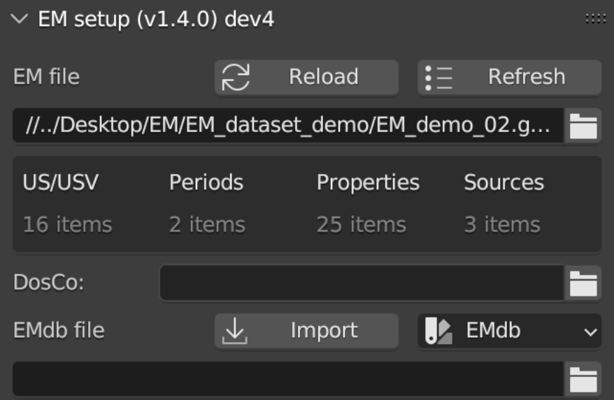
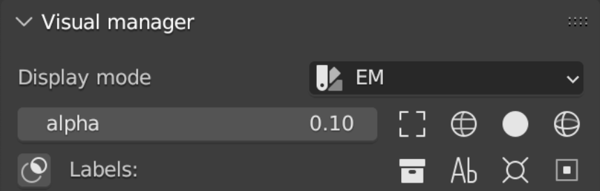
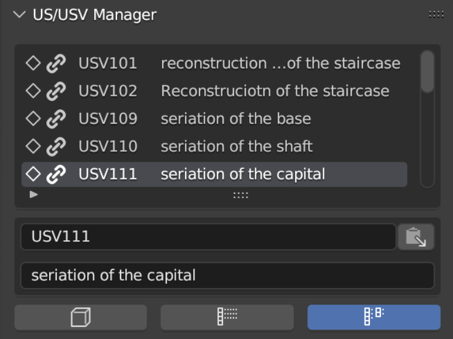
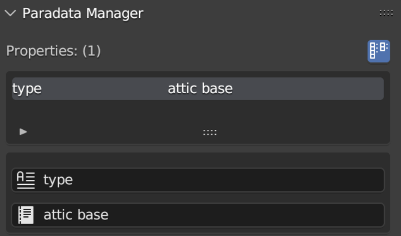
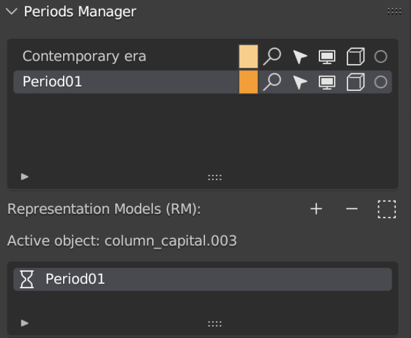
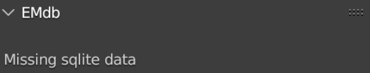
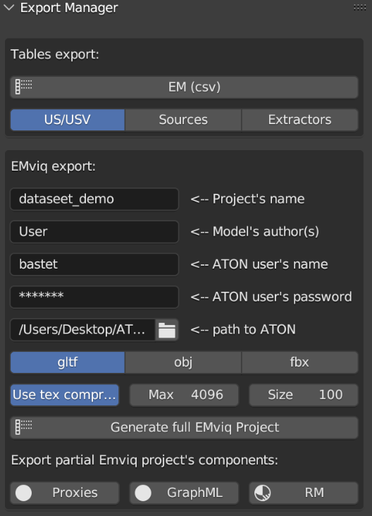

EMtools Structure
=================

The addon is divided into several independent panels that can be easily moved within the dedicated space on the sidebar of Blender. 

After the installation, panels are organized as follows: 

- EM setup; 

- Visual manager; 
 
- US/USV Manager; 
 
- Paradata Manager; 
 
- Periods Manager; 
 
- EMdb; 

- Export Manager. 

.. _EMsetup:

EM setup
--------

.. _EMsetupFIG:

   EM setup Panel

This panel (:numref:`Fig. %s <EMsetupFIG>`)  allows to create the first connection between Blender and the Extended Matrix (.graphml file). 
To establish the link EMTools needs to locate the graphml file (NB: before closing the path windows remember to uncheck *relative path* within the settings. 
Alternatively, it is possible to paste the entire path within the empty line). 
After this step, click on the *Reload* button to establish the connection. 
*Refresh* button allows to update the .graphml file, if changes have been applied on the EM graph during the modelling session. 
Once the connection has been established, EMTools will summarize the most important information (US/USV; Periods; Properties; Sources) within a simple table. 

In this panel users can also link the path to the *DosCo* folder. 
For this step users must follow the same suggestions introduced for the EM file path. 

If the EM graph presents a connection with and external database, EMTools allows to import databases to maintain data connection also within Blender. 
To establish the connection, it is necessary to indicate the exact location of the database and then click on the *import* button. 
For this step users must also follow the suggestions that have already been introduced for the EM file path. 

.. _Visual_Manager:

Visual Manager
--------------

.. _Visual_ManagerFIG:

   Visual Manager panel

This panel (:numref:`Fig. %s <Visual_ManagerFIG>`) consents to manage the visual aspect of the information in the 3D space of Blender. 
Within the *display mode* section, users can filter the visualization of the geometries (the so-called Proxy Models or Proxies) by using *EM* or *Periods*. 
On one hand, using *EM* option, user will visualize Proxies with a monochromatic material that will match their specific type of node (US, USV/s, USV/n, SF, etc..). 
On the other, using *Periods* option, Proxies’ materials will be changed in relation to the chronological period to which proxy models will belong. 

Within the panel user can also control the alpha value of the Proxies’ material (0 = no alpha; 1 = completely transparent).
Other display options allow user to visualize ONLY selected Proxies with different modes (bounding box, wireframe, solid, solid&wireframe). 

*Labels* section allows user to automatically create a label related to the selected proxies. 
First, to assign label it is necessary to insert a camera within the 3D scene. 
Second, once the camera has been oriented (NB: in order to easily orient the camera on the desired proxy or Proxies, user has different solution: manual orientation, by using default command of Blender, or using the add-on *Store View*, which is already contained in Blender), user has to define the exact place where labels will be created (in this case both pivot point and 3D cursor can be used as target point). 
Finally, after selecting the desire number of proxies, by clicking the *Ab* button labels will be visualized oriented with point of view of the camera. 
It’s important to understand that labels will be placed within the camera field of view, NOT on the top of the Proxies’ 3D surface. 
*Collection* button permits to create a collection for the labels. 
Once automatically generated, labels can be easily modified by applying the grab, scale and rotate commands of Blender. Labels will appear on the viewport of Blender and on the rendered images. 

.. _US/USV_Manager:

US/USV Manager
--------------

.. _US/USV_ManagerFIG:

   US/USV Manager panel

This panel (:numref:`Fig. %s <US/USV_ManagerFIG>`) allows to: control the connection between the EM graph and the 3D environment, visualize a complete list of US/USV; automatically select proxy models within the scene. 

First, user can control the *connection status*. 
A *chain not connected* will be the signal of an issue within the EM graph or within the 3D scene (a frequent issue is due to a mismatch between the node name within the EM and the Proxy name in Blender). 

Second, EMTools allows to visualize a complete list of all the US/USV indicated within the EM. 

Third, user can select proxies by following two solutions: *list to proxy* and *proxy to list*. 
In the first case, after selecting a proxy in the list it will be possible to select that proxy within the 3D scene by clicking on the button with the cube. 
In the second case, after selecting a proxy on the scene it will be possible to highlight that geometry in the list and visualize its name. 
A search option is also available after clicking of the white arrow presents at the bottom of the list. 

It’s important to note that between the search section of the list and the three buttons, two text lines allow to read extensively both the name of the selected proxy and its description. 

.. _Paradata_Manager:

Paradata Manager
----------------

.. _Paradata_ManagerFIG:

   Paradata Manager panel

This panel (:numref:`Fig. %s <Paradata_ManagerFIG>`) consent to have access to all the information linked with the subject of the study.  

The *paradata streaming* button on the right corner of the US/USV panel, if active, enables to explore paradata connection (from properties to documents, passing through combiner nodes, if indicated, and extractor nodes) contained in the EM. 
In this specific case, if the button is active, within the rounded brackets on the right side of the nodes visualized (Properties, Extractors, Combiners, and Docs) a number will indicate only nodes related with that precise proxy. 
If *paradata streaming* button is inactive users will visualize all the EM nodes without a connection between them. In this specific case, within the rounded brackets on the right side of the nodes (Properties, Extractors, Combiners, and Docs) a number will indicate all the nodes presented in the EM.

**NB**: to follow the streaming of information user should activate this button. 

Every section (*Properties*, *Extractors*, *Combiners*, and *Docs*) contained a list of nodes. 
As already explained for the *US/USV Manager*, under every list a search box and two lines, that allow to read extensively name and description values, are available. 
*Extractors*, *Combiners* and *Docs* nodes also presented a third lines that allow to reach the repository where the information is located.

(**DEV** version features..)

.. _Periods_Manager:

Periods Manager
---------------

.. _Periods_ManagerFIG:

   Periods Manager panel

This panel (:numref:`Fig. %s <Periods_ManagerFIG>`) lists all the chronological periods of the EM and allows to interact with all the Proxy models using Periods as filter. 
Within the list of Periods, on the right side, different button allow user to:

- change the color of each period;
  
- select all the proxy models associated to one or more periods;
  
- activate or deactivate the ability to select a proxies associated to a specific period;
  
- activate or deactivate the visibility of each period;
  
- activate or deactivate the possibility to visualize the objects attributed to a specific period;

- activate or deactivate the possibility to soloing periods.

As already explained for the previous lists of items, under every list there is a search box. 

The lower part of the panel is dedicated to Representation Models (RMs). 
This section allows user to manually attribute one or more RM to one or more periods (in some cases, especially for structure that has been used for more than one period, it is necessary to associate a RM to multiple periods). 
To attribute an RM to a period user must select one or more geometries and then click on the *+* button. 
On the contrary, to remove an RM from a specific period user must select one or more geometries and then click on the *-* button. 
The third button, the *RM selection* button, allows to select ONLY the RMs that belong to a precise period (**NB**: this option does not work if RMs have not been associated to a specific period). When a RM will be associated to a period a list of epochs will automatically appear under the line *Active object:*. 
In this case a list of epochs it has been necessary since an RM can be attributed to multiple periods. 
This list of epochs is also provided with a search box in the lower part of the panel. 

.. _EMdb:

EMdb
----

.. _EMdbFIG:

   EMdb panel

This panel (:numref:`Fig. %s <EMdbFIG>`) consents to establish a connection between EMTools and an external database. 

.. _Export_Manager:

Export Manager
--------------

.. _Export_ManagerFIG:

   Export Manager panel

This panel (:numref:`Fig. %s <Export_ManagerFIG>`) is divided in two different sections: *tables export* and *EMviq (data) export*. 
The first section allows to automatically export EM data in csv files. 
By pressing one button user can export the entire EM (*EM (csv)* button) or groups of nodes (*US/USV* button, *Sources* button, *Extractors* button). 
The second part of the panel allows to export geometries from Blender to EMviq, that is the 3Dweb app, based on the Aton Framework, that allow to share online, within the same 3D scene, both 3D models (Proxies, Representation models and Source models) and the EM, with all its paradata. 

To export correctly all the data, first it is necessary to control that every geometry (Representation Models and Source models) has been associated with the correct epoch/s.

Second, 3D objects have to be associated to the correct collection of Blender (Representation Models - *RM*; Reality Based - *RB*; *Proxy*).

Third, in order to visualize all the data, user must install Aton [link].

Fourth, before exporting geometries, user must compile all the 5 text boxes corresponding to *Project’s name*, *Model’s name*, *ATON user’s name*, *ATON user’s password* and the *Path to ATON* (where the ATON folder has been stored) and then decide the *file format* (gltf, obj, fbx) and the *texture data* (compression, resolution and quality size). 

Finally, by pressing the *Generate full EMviq Project* button EMTools will create two different folders with both the collection and scenes folder presented in the data folder of ATON. 