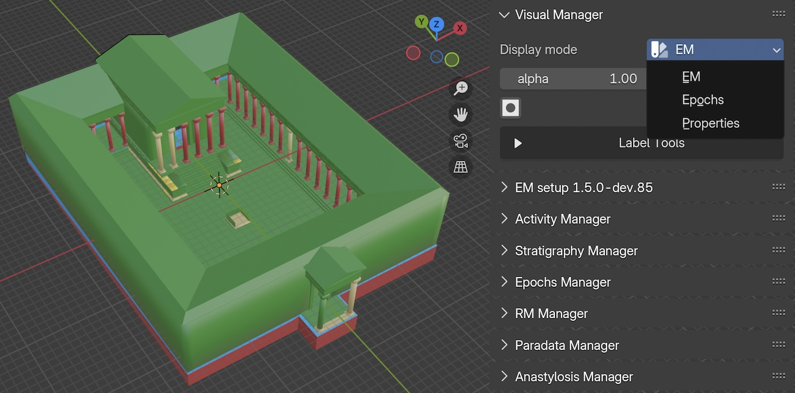
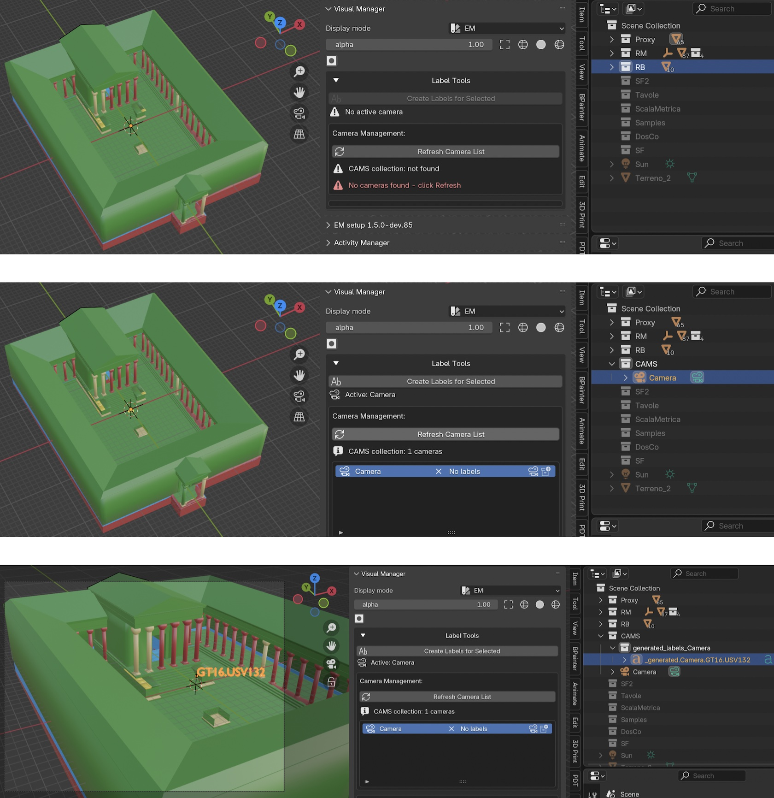
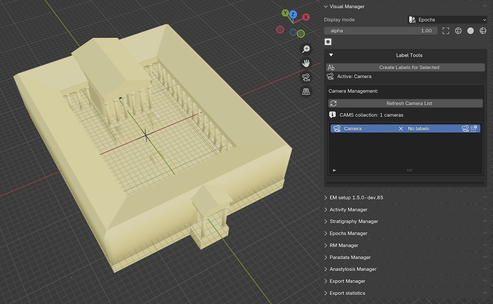
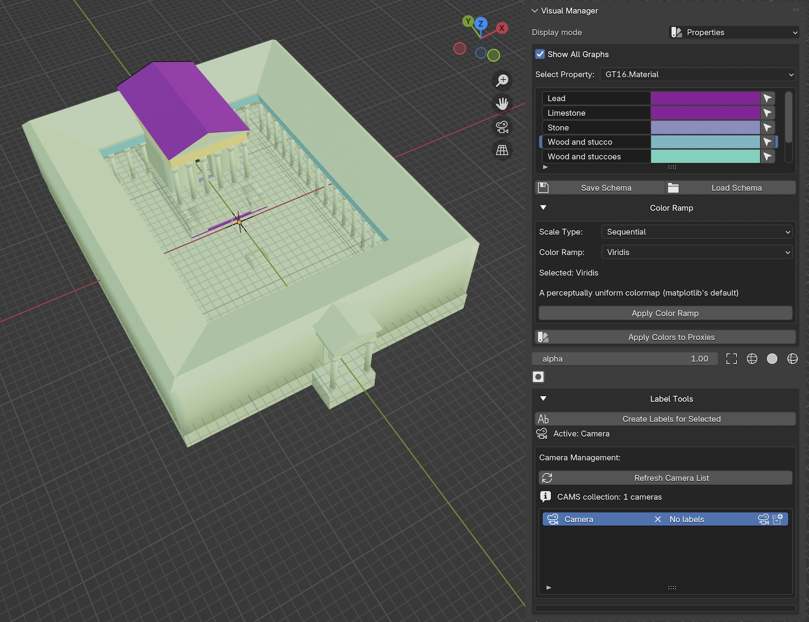
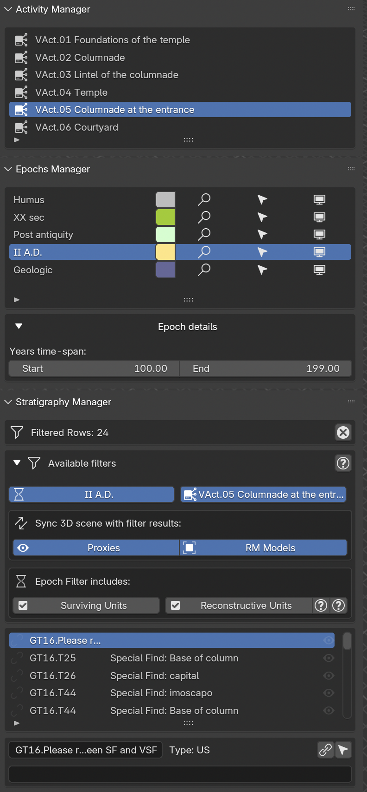
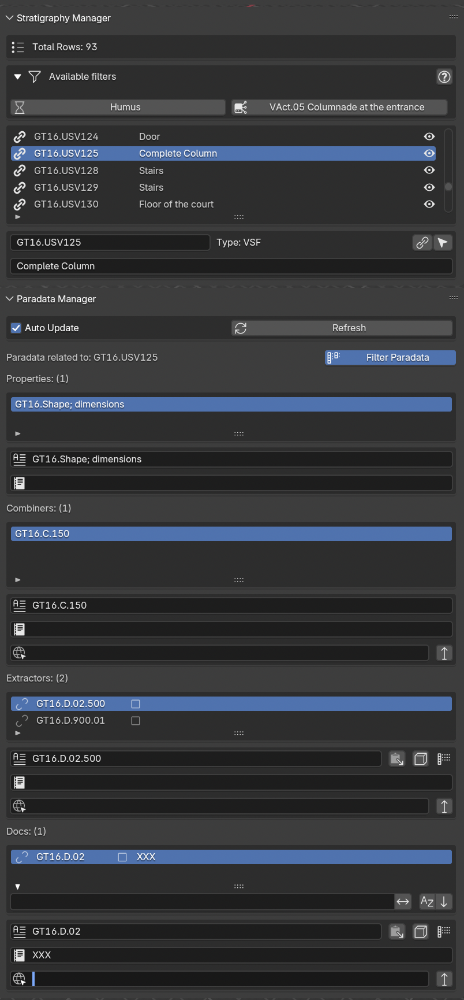
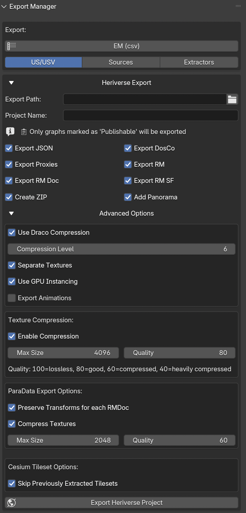
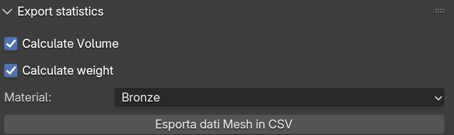

EMtools Structure
=================

The addon is divided into several independent panels that can be easily moved within the dedicated space on the sidebar of Blender (left side of the Viewport). 

Panels are organized as follows: 

- EM setup; 

- Visual manager; 

- Activity Manager;

- Epochs Manager;

- Stratigraphy Manager;

- Paradata Manager;

- Anastylosis Manager;

- RM Manager;

- Export Manager;

- Export statistics.

.. _EMsetup:

EM setup
--------

.. _EMsetupFIG:

.. figure:: img/EMsetup.png
   :width: 400
   :align: center

   EM setup Panel

This panel (:numref:`Fig. %s <EMsetupFIG>`)  allows to create the first connection between Blender and the Extended Matrix (.graphml file).
Press the ``Add GraphML`` and locate the ``.graphml`` file wiin the ``Path`` section (**NB**: before closing the path window remember to uncheck ``relative path`` within the settings. 
Alternatively, it is possible to paste the entire path within the empty line). 

.. _EMsetup_02FIG:

.. figure:: img/EMsetup_02.png
   :width: 400
   :align: center

   GraphML import

When a GraphML is loaded (:numref:`Fig. %s <EMsetup_02FIG>`), on the left side of the EM setup window the GraphML ID will appear (for example, the ID: GT16). 
On the same line, on the right side, a green square will show up.
The green color cofirms that a connection between the GraphML and EMtools has been established.

.. note::

   To correctly link the ``.graphml`` file with the ``EM setup`` panel it is mandaotry to insert, at least, the GraphML ID on the title of the ``Swimlane node`` (**1.5 dev4 palette**); the first node that needs to be imported in the yEd space to start the creation of an Extended Matrix (:numref:`Fig. %s <EM_TITLEFIG>`).

   Example:

   Context name [ID:xx;ORCID:xx;LICENSE:CC-BY-ND]

   Great Temple [ID:GT16;LICENSE:CC-BY-ND]

   .. _EM_TITLEFIG:

   .. figure:: img/EM_TITLE.png
      :width: 400
      :align: center
      
      EM graphml file title example

   
   

Next to the green (or red) square, three buttons complete the right side of the line (:numref:`Fig. %s <EMsetup_02FIG>`): the ``Update`` button allows to refresh the ``.graphml`` file, if changes have been applied on the EM graph during the modelling session; the ``Activate EM`` button consent to explore only the selected GraphML; and the ``pubblish`` button appears when the multigraph mode is enabled.

This version of EMtools allows to activate the ``Multigraph Mode``, this option consent to upload and visualize multiple graphs. 
To upload a new graph and explore its information user can follow all the steps already explained.

.. note::

  This version of EMtools include **info boxes**. 
  When the info button is selected an info box will appears with more information related to that specific part of the tool. 

   .. _EM_info_buttonFIG:

   .. figure:: img/EM_info_button.png
      :width: 400
      :align: center
      
      Example of EM info box

Once the connection has been established, EMTools will summarize the most important information (US/USV; Epochs; Properties; Sources) within a simple table under the ``Path`` section (:numref:`Fig. %s <EMsetup_02FIG>`).

The ``Remove GraphML`` button allows to remove one or more EMs from the EM setup list.

In this panel (:numref:`Fig. %s <EMsetup_02FIG>`) users can also link the path to the *DosCo* folder, where sources are stored. 
To locate sources, users must follow the same guidelines previously outlined for the localization of the EM file. 

If the EM graph presents a connection with and external database, EMTools allows to import databases to maintain data connection also within Blender.

To establish the connection with EMtools:

- expand the ``Auxiliary files`` section and press ``Add``;
- select the type (Generic Excel, PyArchInit, EMdb Excel);
- indicate the exact location of the Auxiliary file and click on the ``Accept`` button. 

.. note::
   When **EMdb Excel** type is selected a ``Format`` menu appears, select the correct format from the list.

Starting from version 1.5, EMtools allows to link external resource folders containing photos, 3D scans, documents and other media files to your Extended Matrix project.
This feature is particularly useful when working with large image collections that need to be referenced and previewed directly from within Blender.

Setting Up Resource Folders
~~~~~~~~~~~~~~~~~~~~~~~~~~~~

To link a resource folder to your Extended Matrix:

1. Expand the ``Auxiliary files`` section in the EM setup panel (:numref:`Fig. %s <resource_folder_setupFIG>`)

2. Select an existing auxiliary file or press ``Add`` to create a new one

3. In the ``Resources:`` field, click the folder icon and navigate to your media folder

4. **Important**: Before confirming the path, make sure to check the ``Relative Path`` option in the file browser settings

.. warning::
   
   Always use **relative paths** when setting up resource folders!
   
   - ✓ Correct: ``//Resources`` or ``//../../SharedFolder/Photos``
   - ✗ Wrong: ``C:\Users\YourName\Project\Resources`` (Windows-specific)
   - ✗ Wrong: ``/Users/yourname/Project/Resources`` (macOS-specific)
   
   Relative paths ensure that your project works correctly when:
   
   - Opening the file on different computers
   - Syncing through cloud services (OneDrive, Dropbox, Google Drive)
   - Sharing the project with collaborators
   - Moving the project to a different location

If a warning appears in red indicating that the path is absolute, reconfigure the path using the relative format.

The Thumbnail System
~~~~~~~~~~~~~~~~~~~~

Once a resource folder is configured, EMtools can automatically generate thumbnail previews of all images in that folder.
The thumbnail system creates a local cache that speeds up image browsing and reduces memory usage.

**How it works:**

- Thumbnails are stored in a folder named ``EM_thumbs/`` next to your ``.blend`` file
- Each resource folder gets its own subfolder (e.g., ``Resources_abc12345``)
- The system remembers which images have been processed to avoid duplicates
- If you sync your project via cloud storage, thumbnails are automatically shared across computers

Generating Thumbnails
~~~~~~~~~~~~~~~~~~~~~

1. In the Auxiliary Files panel, locate the text ``Thumbnails for the resource folder? Click below.``

2. Click the ``(Re)generate thumbnails`` button

3. EMtools will scan all images in the resource folder (including subfolders) and create previews

4. Progress information is displayed in the Blender console

5. The line ``Thumbs: Resources_xxxxxxxx`` shows the name of the cache folder that was created

.. note::
   
   Supported image formats: JPG, PNG, BMP, TIFF, PDF (first page)
   
   The generation process only creates thumbnails for new or modified images. 
   If you click ``(Re)generate`` again, existing thumbnails are skipped automatically.

Viewing Thumbnail Cache
~~~~~~~~~~~~~~~~~~~~~~~

You can verify that thumbnails were created correctly:

- The ``Thumbs: Resources_xxxxxxxx`` line displays the cache folder name
- Click the folder icon 📂 next to this line to open the cache folder in your file manager
- Inside you'll find the ``index.json`` file and thumbnail images organized in subfolders

Using Thumbnails in EMtools
~~~~~~~~~~~~~~~~~~~~~~~~~~~~

Once thumbnails are generated, they are automatically displayed when:

- Browsing DocumentNodes linked to images
- Using the US/USV Manager to view associated documentation
- Working with the Stratigraphy visualization tools

The thumbnail preview provides quick access to your images without having to open them in external applications.

Working Across Multiple Computers
~~~~~~~~~~~~~~~~~~~~~~~~~~~~~~~~~~

If you use cloud storage to sync your project:

1. **First computer**: Set up resource folders using relative paths and generate thumbnails

2. Wait for cloud sync to complete (the ``EM_thumbs/`` folder will be uploaded)

3. **Second computer**: Open the same ``.blend`` file

4. Thumbnails are automatically recognized and ready to use - no need to regenerate them!

.. tip::
   
   If you work on multiple computers, make sure that:
   
   - The ``.blend`` file and resource folders maintain the same relative structure
   - Cloud sync is complete before opening the project
   - You always use the ``//`` prefix for relative paths

Best Practices
~~~~~~~~~~~~~~

- **Keep resources organized**: Use clear folder names like ``Photos``, ``3DScans``, ``Documents``
- **Generate thumbnails periodically**: After adding many new images, regenerate to update the cache
- **Check the hash**: The ``Thumbs: Resources_xxxxxxxx`` code should be identical on all your computers if using relative paths
- **Backup regularly**: Include both the ``.blend`` file and the ``EM_thumbs/`` folder in your backups

.. note::

   For more advanced usage and technical details about the thumbnail system, click the help icon (?) next to the ``Thumbs:`` line in the interface.

Troubleshooting
~~~~~~~~~~~~~~~

**Thumbnails not appearing**
   - Verify that the resource folder path is correct and accessible
   - Click ``(Re)generate thumbnails`` to rebuild the cache
   - Check the Blender console for error messages

**Warning about absolute path**
   - Reconfigure the resource folder using a relative path with ``//`` prefix
   - Example: change ``C:\Project\Resources`` to ``//Resources``

**Different cache folder on another computer**
   - This happens when using absolute paths instead of relative paths
   - Solution: reconfigure all resource folders using relative paths
   - The hash (``Thumbs: Resources_xxxxxxxx``) should match across computers

**Thumbnails folder not syncing**
   - Check that your cloud storage service is actively syncing the ``EM_thumbs/`` folder
   - Some cloud services may need manual folder selection for sync

A third section, the ``Utilities & Settings`` one, is included within the EM setup panel.
Here, users can: convert an EM made with an old version of the formalism, rename Proxies and enable Experimental Features.

In the first case EMtools will automatically convert US and USV nodes to the latest version of the formalism (**NB**: this function will not affect groups).

Within this section, EMtools includes also a button, ``Create Standard Collections``, that allows to automatically create the set of default collections (Proxy, RM, CAMS) related to a reconstruction process with Extended Matrix.

In the second case, by pressing ``Manage Proxies' Prefixes`` button, EMtools will automatically rename Proxies according to the GraphML ID (**NB**: this step is mandatory to mutually connect GraphML and Proxies. User must select geometries before applying the tool).

In the third case, by pressing the ``Enable Experimental Features`` button, a set of Experimental Features will be activated within the sections of the EM setup panel (:numref:`Fig. %s <EMsetup_03_editFIG>`). 

.. _EMsetup_03_editFIG:

.. figure:: img/EMsetup_03_edit.png
   :width: 400
   :align: center
   
   Experimental Features enabled (red rectangles with numbers 1-3)

.. note::

   As highlighted in the red warning, this set of features is experimental and it should not be used within the regular documentation process of the EM (:numref:`Fig. %s <EMsetup_03_editFIG>`).

Here a brief presentation of the Experimental Features, the numebers on the list refer to the numbers specified in :numref:`Fig. %s <EMsetup_04abcFIG>`:

1. On the upper part of the panel the ``Switch to 3D GIS`` button allows to instantly switch from the ``EM mode`` to a ``3D GIS mode`` where users can link an external database to EMtools (:numref:`Fig. %s <EMsetup_04abcFIG>`). The activation of the ``3D GIS mode`` consents to connect an External database to the 3D environment of Blender via EMtools. User have three different type of external databases (*Generic Excel*, *PyArchInit*, *EMdb Excel*) to choose from. By pressing the corresponding button a diverse set of options will appear. After setting all the required information the external db will be import within EMtools.

2. Within the ``DosCo Folder`` section (:numref:`Fig. %s <EMsetup_03_editFIG>`) the ``More option`` menu appears, this new part of the add-on permits to populate Extractors, documents and Combiners using DosCo files.
   
3. In the ``Utilities & Settings`` (:numref:`Fig. %s <EMsetup_03_editFIG>`) the activation of the ``Enable Experimental Features`` button activates the ``Experimental Tools`` section with ``Rebuild Graph Indices``, ``Benchmark Property Functions``, and the collapsible **Create a GraphML** wizard.

   - **Create a GraphML**: A 3-step panel-based wizard for generating Extended Matrix GraphML files from Excel data — either filled manually using downloadable templates or produced by AI-assisted extraction from archaeological reports. The wizard works entirely in memory until export:

     - **Step 1 — Convert Stratigraphy**: Loads ``stratigraphy.xlsx`` (24-column template) and creates an s3dgraphy graph in memory.
     - **Step 2 — Enrich with Paradata** (optional): Loads ``em_paradata.xlsx`` and adds per-property provenance chains (PropertyNode → ExtractorNode → DocumentNode) to matching nodes.
     - **Step 3 — Export GraphML**: Saves the graph to a ``.graphml`` file. Import this file via **File > Import EM file** to populate the Blender scene.

     The panel also provides **template download** buttons and an **AI Extraction Prompt** section with a language selector and a one-click **Copy AI Prompt to Clipboard** button. See :doc:`creating_em` for the full workflow.

     **Warning**: This feature is experimental. Always verify the generated GraphML before using it in production.

.. _EMsetup_04abcFIG:

.. figure:: img/EMsetup_04abc.jpg
   :width: 400
   :align: center

   3D GIS mode

.. _Visual_Manager:

Visual Manager
--------------

.. _EM_VM_panelFIG:

   Visual Manager modes (EM, Epochs, Properties)

This panel (:numref:`Fig. %s <EM_VM_panelFIG>`) consents to manage the appearence of the so-called Proxy models (or Proxies) in the 3D space of Blender.

Within the ``Display mode`` section, users can filter the visualization of the geometries by using ``EM``, ``Epochs``, and ``Properties``.

.. _EM_VM_Proxy_cam_label_01-03FIG:

   Visual Manager EM-mode and the labeling workflow

``EM`` will visualize Proxies with a monochromatic material that will match their node (US, USV/s, USV/n, SF, USD, serSU, serUSD, etc..; :numref:`Fig. %s <EM_VM_Proxy_cam_label_01-03FIG>`).

Within the panel (:numref:`Fig. %s <EM_VM_Proxy_cam_label_01-03FIG>`) user can also control the ``alpha`` value of the Proxies’ material (0 = completely transparent; 1 = no alpha).
Other display options allow user to visualize ONLY selected Proxies with different modes (``bounding box``, ``wireframe``, ``solid``, ``solid&wireframe``). 

The ``Label Tools`` section allows user to automatically create a label related to the selected proxies.

Firstly, to start the labelling process users must create the **CAMS** collection and move inside an already existing **camera** (or a new one), then by pressing the ``Refresh Camera List`` button the tool will automaticcally visualize the camera and display information.

Once the camera has been oriented (**NB**: in order to easily orient the camera on the desired proxy or Proxies, user has different solution: manual orientation, by using default command of Blender, or using the add-on ``Store View``, which is already in Blender) and one or more Proxies has been selected, by pressing the ``Create Labels for Selected`` button a new label will appear.

Since labels will appear within the frame of the camera, **NOT** on top of the Proxies’ 3D surface, to visualise them user must enter on the ``Active camera view mode`` of Blender (**Numpad 0** button).

User can also locate labels (as text objects) within the Outliner of Blender in the ``_generated_labels_Camera`` collection.
Once automatically generated, labels can be easily modified by applying the ``Grab``, ``Scale``, and ``Rotate`` commands of Blender. Labels will appear both on the viewport of Blender and on the rendered images.

.. _EM_VM_EpochsFIG:

   Visual Manager Epochs-mode

``Epochs`` change Proxies’ materials according to the chronological period to which proxy models belong (:numref:`Fig. %s <EM_VM_EpochsFIG>`).

.. _EM_VM_PropertiesFIG:

   Visual Manager Properties-mode

``Properties`` apply a new material to every Proxy model (:numref:`Fig. %s <EM_VM_PropertiesFIG>`).
This specific section of the panel reads all the properties of the EM.
When a specific property is selected the filter visualizes all the related information.

The panel allows to:

- freely attribute a color material
- select Proxies with the same property
- save the color schema
- load a specific color schema

When ``Display mode`` is set to ``Properties`` a ``Color Ramp`` appears on the lower part of the *Visual Manager* panel.
The menu allows to set the ``Scale Type``, with three option (``Sequential``, ``Diverging``, and ``Qualitative``), and the ``Color Ramp`` type (``Viridis``, ``Blues``, ``Heat``).

Everytime a *Color Ramp* is selected the line ``Selected`` will be automatically updated.
The ``Apply Color Ramp`` button consents to attribute and visualize the color ramp selected in the Property list.
When a color ramp is defined, by pressing the ``Apply Colors to Proxies`` button EMtools will automatically transfer colors to Proxies.

.. _Activity_Manager:

Activity Maager
---------------

.. _EM_Act_ManagerFIG:

.. figure:: img/EM_Act_Manager.jpg
   :width: 400
   :align: center

   Activity Manager panel

This panel (:numref:`Fig. %s <EM_Act_ManagerFIG>`) list all the activities groups included in the EM graph file.

.. _Epochs_Manager:

Epochs Manager
--------------

.. _EM_Stratig-Epoch_ManagerFIG:

   Epochs Manager panel

Within this panel epochs are listed following the order indicated in the EM graph.
For every epoch the tool automatically shows the corresponding colors.

In the ``Epoch details`` panel, when an epoch is selected, time-span data is displayed (``start`` and ``end`` values).
To visualize this time values, **user must indicate** the time-span for every row of the EM within the first cell (example: II A.D. [start:100;end:199]).

Epochs can be **selected**, **unselected** and **hide** by pressing the three symbols located on the right side of the Epochs list, after the color preview icon.
The selections made within both the **Activity Manager** and the **Epochs Manager** are useful to enable the Stratigraphy filter, in the **Stratigraphy Manager** panel (:numref:`Fig. %s <EM_Stratig-Epoch_ManagerFIG>`).

.. _Stratigraphy_Manager:

Stratigraphy Manager
--------------------

This tool allows to filter all the EM graph nodes using activities and epochs (:numref:`Fig. %s <EM_Stratig-Epoch_ManagerFIG>`). 
These two values, when selected, are automatically added by EMtools in the ``Available filters`` section.
To edit the filter process of the EM graph, select:

- ``Epochs`` and ``Activities`` buttons to visualize nodes related to a specific action in a specific time;

- ``Proxies`` and ``RM Models`` buttons to sync and display in the 3D viewport of Blender geometries related to Proxies, RM models, or both;

- ``Surviving Units`` and ``Reconstruction Units`` buttons to include in the Epoch filter units that survive in multiple epochs, USVs, or both (press on the ``?`` button for more information).

When filters are applied, the number of filtered data is continuously updated on the upper part of the panel and a list of geometries appears in the lower part of the panel itself (press on the ``X`` button to clean filters).
On the right side of the list, by selecting the  **chain symbol** user can select a specific geometry (a *broken chain* means there is an issue within the EM graph or within the 3D scene; **NB** a common issue is due to a mismatch between the node name within the EM and the Proxy name in Blender).
Then, the ``Frame selected`` command of Blender will directly  move the point of view to the selected 3D model.

.. _Paradata_Manager:

Paradata Manager
----------------

.. _EM_Paradata_ManagerFIG:

   Paradata Manager panel

This panel (:numref:`Fig. %s <EM_Paradata_ManagerFIG>`) consents to explore all the information stored in every Paradata Node group of an EM graph.

The ``Filter Paradata`` button, located on the right corner of the panel, if enable, activates the possibility to explore paradata connection (from properties to documents, passing through combiner nodes, if indicated, and extractor nodes) contained in the EM. 
In this specific case, within the rounded brackets located on the right side of the corresponding node (Properties, Extractors, Combiners, and Docs) a number will indicate the amount of nodes related to that precise proxy. 

If ``Filter Paradata`` button is disable users will visualize all the EM nodes of the EM graph without a connection between them. 
In this specific case, within the rounded brackets on the right side of the nodes (Properties, Extractors, Combiners, and Docs) a number will indicate all the paradata nodes of the EM.

**NB**: to follow the streaming of information user should select the  ``Filter Paradata`` button. 

Every section (**Properties**, **Extractors**, **Combiners**, and **Docs**) contained a list of nodes. 
Under every list two lines allow to read extensively both the name and the description data related to every selected Paradata node. 
**Extractors**, **Combiners**, and **Docs** nodes also presented a third lines that allow to reach the repository where the information is located.

.. _RM_Manager:

Representation models Manager
-----------------------------

.. _RM_ManagerFIG:

.. figure:: img/RM_Manager.png
   :width: 400
   :align: center 

   RM Manager panel

This panel (:numref:`Fig. %s <RM_ManagerFIG>`) allows to manage all the Representation models related to the reconstruciton project.
With the three buttons on the upper part of the panel (``Update from Scene``, ``Update from Graph``, and ``Select from Object``) it is possible to upadate the RM list and select the corresponding 3D model.

Other three actions can be made on the selected object by pressing the buttons ``Add Selected``, ``Remove Selected``, and ``Demote from RM``. 
The first add the selected RM object to the active epoch, the second remove the active epoch fromm the selected RM object, and the third completely remove the selected RM from both the epochs and the graph.

The ``Add New Cesium Tileset`` allows to simply add an empty Cesium tileset object to the active epoch, this option will be useful for sharing data via the 3D viewer (online or local).

At the center of the panel the RM list shows all the selected Representation Models, on the right side of the list a set of buttons replicste actions already described (**add**, **select**, **publish**, and **remove**).
Under the RM list a box highlights the object currently selected and its the epoch.

When Experimental features are enabled (see EM setup section), within the ``Settings (experimental)`` section new functions appears; these settings are still under development.

.. _Export_Manager:

Export Manager
--------------

.. _EM_Export_ManagerFIG:

   Export Manager panel

This panel (:numref:`Fig. %s <EM_Export_ManagerFIG>`) is divided in two different sections: **Export** and **Heriverse Export**. 
The first section allows to automatically export EM data in csv files. 
By pressing one button user can export the entire EM (``EM (csv)`` button) or groups of nodes (``US/USV`` button, ``Sources`` button, ``Extractors`` button). 

The second part of the panel allows to export geometries from Blender to Heriverse, that is the 3Dweb app, based on the Aton Framework [link], that allow to share online, within the same 3D scene, both 3D models (Proxies, Representation models and Source models) and the EM, with all its paradata. 

To export correctly all the data, first it is necessary to control that every geometry (Representation Models and Source models) has been associated with the correct epoch/s.

Second, 3D objects have to be stored in the correct collection of Blender (Representation Models - **RM**; Reality Based - **RB**; **Proxy**).

Fourth, before exporting geometries, user must: locate the folder where the Heriverse project will be saved, set the name of the Project, and check/uncheck the desired options. 

Finally, by pressing the ``Export Heriverse Project`` button, EMTools will export the project within a specific folder ready for the upload on Heriverse. 

.. _Export_Statistics:

Export statistics
-----------------

.. _EM_Export_StatisticsFIG:

   Export statistics panel

This panel (:numref:`Fig. %s <EM_Export_StatisticsFIG>`) gives the possibility to export statistics data (**volume** and **weight**) related to the selected objects, data will be available after pressing the ``Export data in CSV`` button. 

.. _Keyboard_Shortcuts:

Keyboard Shortcuts
------------------

EMtools provides keyboard shortcuts for common operations in the **3D Viewport**. All shortcuts are context-aware and only work when relevant data is available.

.. list-table:: Available Shortcuts
   :widths: 30 25 45
   :header-rows: 1

   * - Shortcut
     - Action
     - Description
   * - **F5** (macOS/Win/Linux)
     - Reload GraphML
     - Reloads the active GraphML file from disk
   * - **Option+F** (macOS)
       **Alt+F** (Win/Linux)
     - Select List Item
     - Selects the list element corresponding to the active 3D proxy

.. note::
   More shortcuts will be added in future versions. The system is designed to be easily expandable.