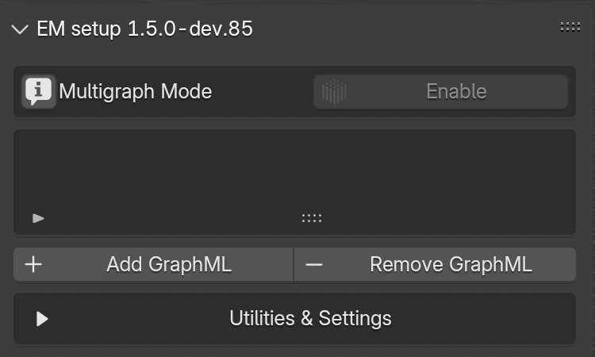
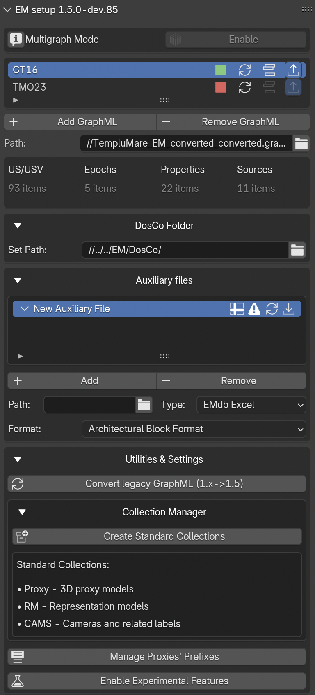
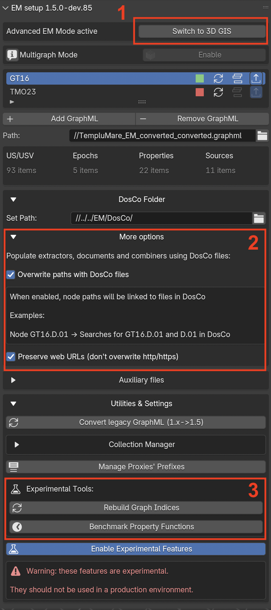
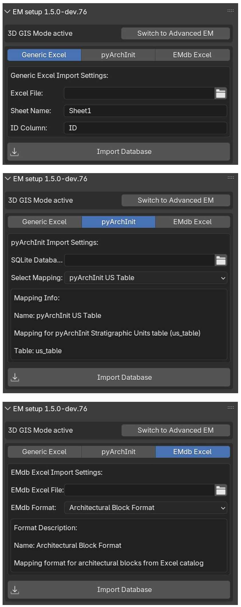
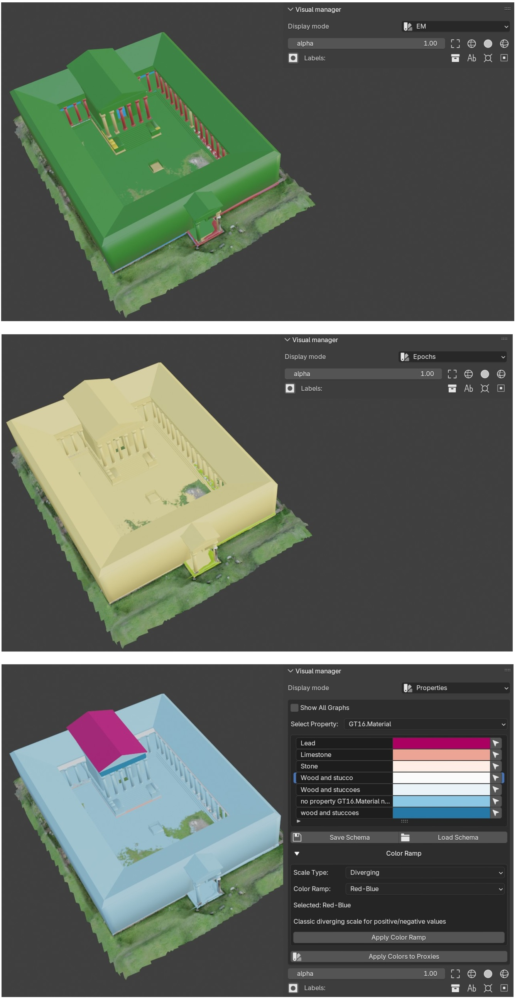
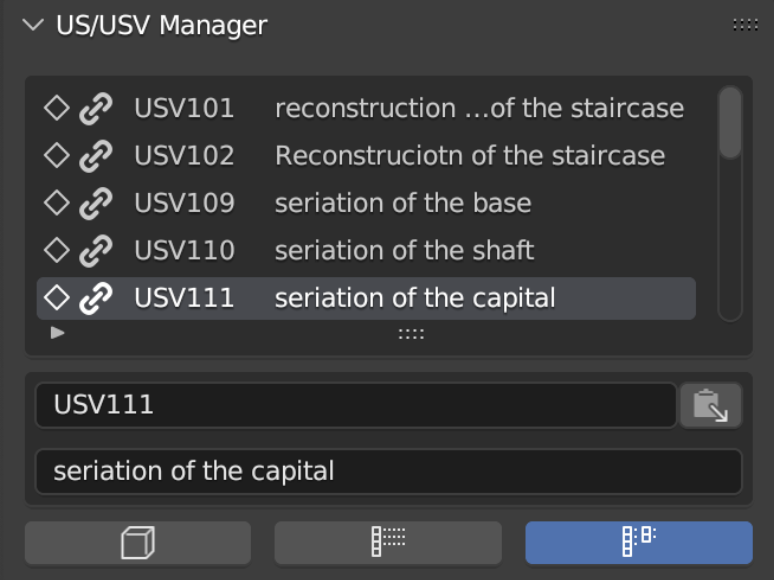
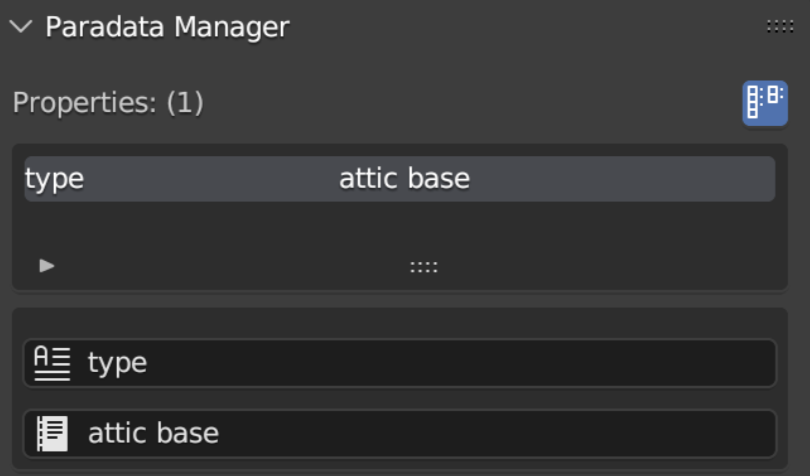
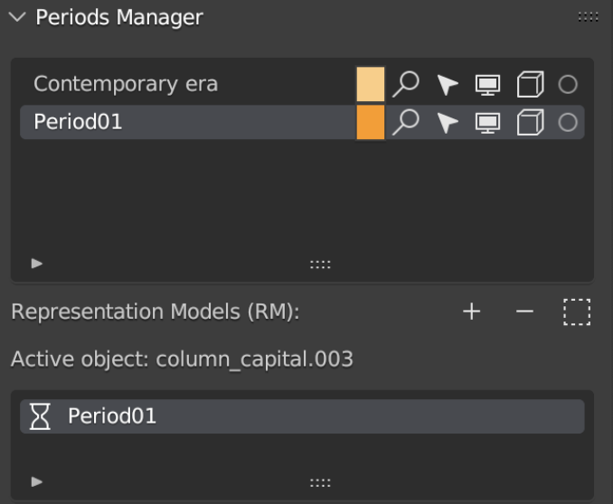
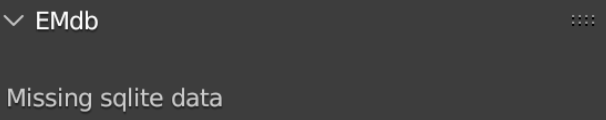
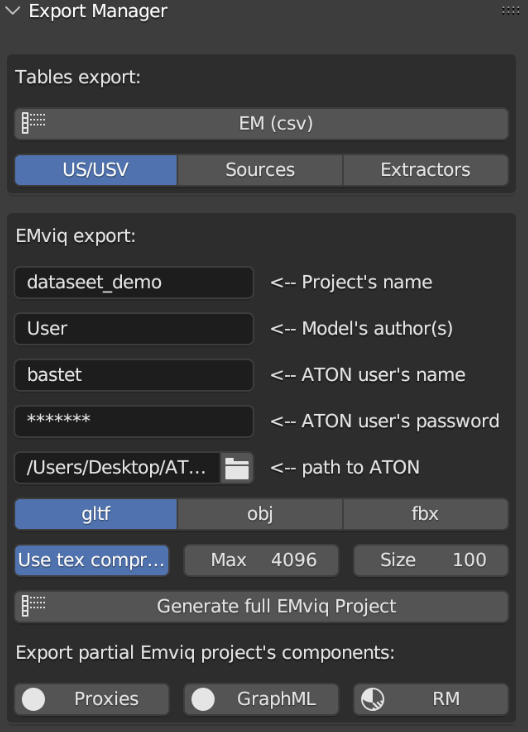

EMtools Structure
=================

The addon is divided into several independent panels that can be easily moved within the dedicated space on the sidebar of Blender (left side of the Viewport). 

Panels are organized as follows: 

- EM setup; 

- Visual manager; 

- Activity Manager;

- Stratigraphy Manager;

- Epochs Manager;

- Paradata Manager;

- Anastylosis Manager;

- RM Manager;

- Export Manager;

- Export statistics.

.. _EMsetup:

EM setup
--------

.. _EMsetupFIG:

   EM setup Panel

This panel (:numref:`Fig. %s <EMsetupFIG>`)  allows to create the first connection between Blender and the Extended Matrix (.graphml file). 
To establish the link, EMTools needs to locate the ``.graphml`` file (**NB**: before closing the path window remember to uncheck ``relative path`` within the settings. 
Alternatively, it is possible to paste the entire path within the empty line). 
Press the ``Add GraphML`` button to establish the connection.

.. _EMsetup_02FIG:

   GraphML import

When a GraphML is loaded (:numref:`Fig. %s <EMsetup_02FIG>`), on the left side of the EM setup window the GraphML ID will appear (for example, the ID: GT16). 
On the same line, on the right side, a green square will show up.
The green color cofirms that a connection between the GraphML and EMtools has been established.

.. note::
   To correctly link the ``.graphml`` file with the ``EM setup`` panel it is mandaotry to insert, at least, the GraphML ID on the title of the ``Swimlane node`` (**1.5 dev4 palette**); the first node that needs to be imported in the yEd space to start the creation of an Extended Matrix.

   .. figure:: img/EM_TITLE.png
      :width: 400
      :align: center
      
      EM graphml file title example

   
   Example:

   Context name [ID:xx;ORCID:xx;LICENSE:CC-BY-ND]

   Great Temple [ID:GT16;LICENSE:CC-BY-ND]

Three buttons complete the right side of the line: the ``Update`` button allows to refresh the ``.graphml`` file, if changes have been applied on the EM graph during the modelling session; the ``Activate EM`` button consent to explore only the selected GraphML; and the pubblish button when the multigraph mode is active.

This version of EMtools allows to activate the ``Multigraph Mode``, this option consent to upload and visualize multiple graphs. 
To upload a new graph and explore its information user can follow the steps already explained.

..note::
  This version of EMtools include **info boxes**. 
  When this button is selected an info box will appears with more information related to that specific part of the tool. 

Once the connection has been established, EMTools will summarize the most important information (US/USV; Epochs; Properties; Sources) within a simple table.

The ``Remove GraphML`` button allows to remove one or more EMs from the EM setup list.

In this panel users can also link the path to the *DosCo* folder, where sources are stored. 
For this step users must adhere to the same guidelines previously outlined for the localization of the EM file. 

If the EM graph presents a connection with and external database, EMTools allows to import databases to maintain data connection also within Blender.

To establish the connection with EMtools: 
- expand the ``Auxiliry files`` section and press ``Add``
- select the type (Generic Excel, PyArchInit, EMdb Excel)
- indicate the exact location of the Auxiliary file and click on the ``Accept`` button. 

**NB**: when EMdb Excel type is select a Format menu appears, select the correct format from the list.

A third section, the ``Utilities & Settings`` one, is included within the EM setup panel.
Here, users can: convert an EM made with an old version of the formalism, rename Proxies and enable Experimental Features.

In the first case EMtools will automatically convert US and USV nodes to the latest version of the formalism (**NB**: this function will not affect groups).

Within this section, EMtools includes also a button, ``Create Standard Collections``, that allows to automatically create the set of default collections (Proxy, RM, CAMS) related to a reconstruction process with Extended Matrix.

In the second case, by pressing ``Manage Proxies' Prefixes`` button, EMtools will automatically rename Proxies according to the GraphML ID (**NB**: this step is mandatory to mutually connect GraphML and Proxies. User must select geometries before applying the tool).

In the third case, by pressing the ``Enable Experimental Features`` button, a set of Experimental Features will be activated within the sections of the EM setup panel (:numref:`Fig. %s <EMsetup_03_editFIG>`). 

.. note::
   As highlighted in the red warning, this set of features is experimental and it should not be used within the regular documentation process of the EM (:numref:`Fig. %s <EMsetup_03_editFIG>`).

   1. On the upper part of the panel the ``Switch to 3D GIS`` button allows to instantly switch from the ``EM mode`` to a ``3D GIS mode`` where users can link an external database to EMtools (:numref:`Fig. %s <EMsetup_04abcFIG>`).
   The activation of the ``3D GIS mode`` consents to connect an External database to the 3D environment of Blender via EMtools.
   User have three different type of external databases (*Generic Excel*, *PyArchInit*, *EMdb Excel*) to choose from.
   By pressing the corresponding button a diverse set of options will appear.
   After setting all the required information the external db will be import within EMtools.
   2. Within the ``DosCo Folder`` section the ``More option`` menu appears, this new part of the add-on permits to populate Extractors, documents and Combiners using DosCo files.
   3. In the ``Utilities & Settings`` the activation of the ``Enable Experimental Features`` button reveals three new buttons: ``Create default Collections``, ``Rebuild Graph Indices`` and ``Benchmark Property Functions``.
   All these buttons activate experimental functions which are still under development.

   Experimental Features enabled (red rectangles with numbers 1-3)
   
.. _EMsetup_03_editFIG:

   

   
.. _EMsetup_04abcFIG:

   3D GIS mode

.. _Visual_Manager:

Visual Manager
--------------

.. _VisualManager_01-03FIG:

   Visual Manager modes (EM, Epochs, Properties)

This panel (:numref:`Fig. %s <VisualManager_01-03FIG>`) consents to manage the aspect of the so-called Proxy models (or Proxies) in the 3D space of Blender.

Within the ``Display mode`` section, users can filter the visualization of the geometries by using *EM*, *Epochs*, and *Properties*:

- ``EM`` will visualize Proxies with a monochromatic material that will match their node (US, USV/s, USV/n, SF, etc..);
- ``Epochs`` change Proxies’ materials according to the chronological period to which proxy models belong;
- ``Properties`` apply a new material to every Proxy model.
This specific section of the panel reads all the properties of the EM.
When a specific property is selected the filter visualizes all the related information.

The panel allows to:

- freely attribute a color material
- select Proxies with the same property
- save the color schema
- load a specific color schema

When *Display mode* is set to *Properties* a ``Color Ramp`` appears on the lower part of the *Visual Manager* panel.
The menu allows to set the ``Scale Type``, with three option (``Sequential``, ``Diverging``, and ``Qualitative``), and the ``Color Ramp`` type (``Viridis``, ``Blues``, ``Heat``).
Everytime a *Color Ramp* is selected the line ``Selected`` will be automatically updated.
The ``Apply Color Ramp`` button consents to attribute and visualize the color ramp selected in the Property list.
When a color ramp is defined, by pressing the ``Apply Colors to Proxies`` button EMtools will automatically transfer colors to Proxies.

Within the panel (:numref:`Fig. %s <VisualManager_01-03FIG>`) user can also control the ``alpha`` value of the Proxies’ material (0 = completely transparent; 1 = no alpha).
Other display options allow user to visualize ONLY selected Proxies with different modes (``bounding box``, ``wireframe``, ``solid``, ``solid&wireframe``). 

The ``Labels`` section allows user to automatically create a label related to the selected proxies.

To label 3D models, user need to:

- insert a camera within the 3D scene. 
- once the camera has been oriented (**NB**: in order to easily orient the camera on the desired proxy or Proxies, user has different solution: manual orientation, by using default command of Blender, or using the add-on ``Store View``, which is already in Blender), user has to define the exact place where labels will be created (in this case both pivot point and 3D cursor can be used as target point). 
- after selecting the desire number of proxies, by clicking the ``Ab`` button labels will be visualized oriented with point of view of the camera.

**NB**: labels will be placed within the camera field of view, NOT on the top of the Proxies’ 3D surface. 

The ``Collection`` button permits to create a collection for the labels. 

Once automatically generated, labels can be easily modified by applying the ``Grab``, ``Scale``, and ``Rotate`` commands of Blender. Labels will appear on the viewport of Blender and on the rendered images. 

.. _US/USV_Manager:

US/USV Manager
--------------

.. _US/USV_ManagerFIG:

   US/USV Manager panel

This panel (:numref:`Fig. %s <US/USV_ManagerFIG>`) allows to: control the connection between the EM graph and the 3D environment, visualize a complete list of US/USV; automatically select proxy models within the scene. 

First, user can control the *connection status*. 
A *chain not connected* will be the signal of an issue within the EM graph or within the 3D scene (a frequent issue is due to a mismatch between the node name within the EM and the Proxy name in Blender). 

Second, EMTools allows to visualize a complete list of all the US/USV indicated within the EM. 

Third, user can select proxies by following two solutions: *list to proxy* and *proxy to list*. 
In the first case, after selecting a proxy in the list it will be possible to select that proxy within the 3D scene by clicking on the button with the cube. 
In the second case, after selecting a proxy on the scene it will be possible to highlight that geometry in the list and visualize its name. 
A search option is also available after clicking of the white arrow presents at the bottom of the list. 

It’s important to note that between the search section of the list and the three buttons, two text lines allow to read extensively both the name of the selected proxy and its description. 

.. _Paradata_Manager:

Paradata Manager
----------------

.. _Paradata_ManagerFIG:

   Paradata Manager panel

This panel (:numref:`Fig. %s <Paradata_ManagerFIG>`) consent to have access to all the information linked with the subject of the study.  

The *paradata streaming* button on the right corner of the US/USV panel, if active, enables to explore paradata connection (from properties to documents, passing through combiner nodes, if indicated, and extractor nodes) contained in the EM. 
In this specific case, if the button is active, within the rounded brackets on the right side of the nodes visualized (Properties, Extractors, Combiners, and Docs) a number will indicate only nodes related with that precise proxy. 
If *paradata streaming* button is inactive users will visualize all the EM nodes without a connection between them. In this specific case, within the rounded brackets on the right side of the nodes (Properties, Extractors, Combiners, and Docs) a number will indicate all the nodes presented in the EM.

**NB**: to follow the streaming of information user should activate this button. 

Every section (*Properties*, *Extractors*, *Combiners*, and *Docs*) contained a list of nodes. 
As already explained for the *US/USV Manager*, under every list a search box and two lines, that allow to read extensively name and description values, are available. 
*Extractors*, *Combiners* and *Docs* nodes also presented a third lines that allow to reach the repository where the information is located.

(**DEV** version features..)

.. _Periods_Manager:

Periods Manager
---------------

.. _Periods_ManagerFIG:

   Periods Manager panel

This panel (:numref:`Fig. %s <Periods_ManagerFIG>`) lists all the chronological periods of the EM and allows to interact with all the Proxy models using Periods as filter. 
Within the list of Periods, on the right side, different button allow user to:

- change the color of each period;
  
- select all the proxy models associated to one or more periods;
  
- activate or deactivate the ability to select a proxies associated to a specific period;
  
- activate or deactivate the visibility of each period;
  
- activate or deactivate the possibility to visualize the objects attributed to a specific period;

- activate or deactivate the possibility to soloing periods.

As already explained for the previous lists of items, under every list there is a search box. 

The lower part of the panel is dedicated to Representation Models (RMs). 
This section allows user to manually attribute one or more RM to one or more periods (in some cases, especially for structure that has been used for more than one period, it is necessary to associate a RM to multiple periods). 
To attribute an RM to a period user must select one or more geometries and then click on the *+* button. 
On the contrary, to remove an RM from a specific period user must select one or more geometries and then click on the *-* button. 
The third button, the *RM selection* button, allows to select ONLY the RMs that belong to a precise period (**NB**: this option does not work if RMs have not been associated to a specific period). When a RM will be associated to a period a list of epochs will automatically appear under the line *Active object:*. 
In this case a list of epochs it has been necessary since an RM can be attributed to multiple periods. 
This list of epochs is also provided with a search box in the lower part of the panel. 

.. _EMdb:

EMdb
----

.. _EMdbFIG:

   EMdb panel

This panel (:numref:`Fig. %s <EMdbFIG>`) consents to establish a connection between EMTools and an external database. 

.. _Export_Manager:

Export Manager
--------------

.. _Export_ManagerFIG:

   Export Manager panel

This panel (:numref:`Fig. %s <Export_ManagerFIG>`) is divided in two different sections: *tables export* and *EMviq (data) export*. 
The first section allows to automatically export EM data in csv files. 
By pressing one button user can export the entire EM (*EM (csv)* button) or groups of nodes (*US/USV* button, *Sources* button, *Extractors* button). 
The second part of the panel allows to export geometries from Blender to EMviq, that is the 3Dweb app, based on the Aton Framework, that allow to share online, within the same 3D scene, both 3D models (Proxies, Representation models and Source models) and the EM, with all its paradata. 

To export correctly all the data, first it is necessary to control that every geometry (Representation Models and Source models) has been associated with the correct epoch/s.

Second, 3D objects have to be associated to the correct collection of Blender (Representation Models - *RM*; Reality Based - *RB*; *Proxy*).

Third, in order to visualize all the data, user must install Aton [link].

Fourth, before exporting geometries, user must compile all the 5 text boxes corresponding to *Project’s name*, *Model’s name*, *ATON user’s name*, *ATON user’s password* and the *Path to ATON* (where the ATON folder has been stored) and then decide the *file format* (gltf, obj, fbx) and the *texture data* (compression, resolution and quality size). 

Finally, by pressing the *Generate full EMviq Project* button EMTools will create two different folders with both the collection and scenes folder presented in the data folder of ATON. 