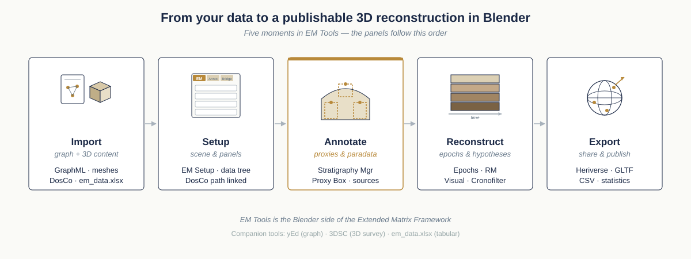

Welcome to the EM Tools Documentation
=====================================

**EM Tools** is a Blender extension that creates a connection between the Extended Matrix (``.graphml`` file) and the 3D environment of Blender (proxy files). With EM Tools you can import, manage, visualize, modify, represent and export all the information (geometries, data and paradata) concerning micro and macro scale contexts, single objects or collections of objects.

The extension is developed by E. Demetrescu at CNR-ISPC (Rome, former CNR-ITABC).

.. admonition:: First time here?
   :class: tip

   If this is your very first contact with the Extended Matrix project, the recommended landing page is `extendedmatrix.org <https://www.extendedmatrix.org>`__ — it explains *what* EM is, *who* it is for, and *which* of the manuals you should open next. The page you are reading now is the **EM Tools manual**: the practical guide to the Blender add-on. The complementary `language manual <https://docs.extendedmatrix.org>`__ is where the formal notation is defined.

   *EM Tools at a glance: the five moments your work will move through, from importing the graph and the 3D content to exporting a publishable reconstruction. The panels in the addon follow this order.*

.. admonition:: Where this manual sits in the EM ecosystem
   :class: hint

   You are reading the **EM Tools** manual — the Blender add-on. For
   the broader Extended Matrix ecosystem (the formal language, the
   s3dgraphy library, 3DSC, Heriverse), see
   :ref:`em-ecosystem-map` at the bottom of this page.

Start here
----------

Pick the entry that fits you best. Each path is short and ends back at the panels reference.

.. admonition:: I work with sources, stratigraphy and reconstruction logic
   :class: tip

   Begin with the formal language at `the EM language docs <https://docs.extendedmatrix.org>`__, then come back here for :doc:`installation`, the :doc:`tutorials/12-install-yed-blender` walkthrough, and the :doc:`tutorials/13-first-matrix-creation` exercise. The :doc:`panels/stratigraphy_manager` is where most of your work will happen.

.. admonition:: I build and texture 3D models and want to enrich them with EM data
   :class: tip

   Go straight to :doc:`installation`, then follow :doc:`tutorials/12-install-yed-blender` and :doc:`tutorials/13-first-matrix-creation`. From there, :doc:`panels/em_setup`, :doc:`panels/proxy_box_creator` and :doc:`panels/visual_manager` cover the daily authoring loop. Export options are in :doc:`export_guide`.

.. admonition:: I want to extend EM Tools, integrate it, or contribute code
   :class: tip

   Read :doc:`development_setup` and :doc:`api_reference`, then :doc:`contributing` for the workflow. The s3Dgraphy library — bundled inside the addon — is what you will most often touch; its source lives in the `EM-blender-tools repo <https://github.com/zalmoxes-laran/EM-blender-tools>`_.

.. note::
   Starting from version 1.5, EM Tools is distributed as a Blender Extension (``.zip`` file)
   which automatically manages all Python dependencies.

Quick Start
-----------

- **For users** — download the latest release and install via Blender's preferences. See :doc:`installation`.
- **For developers** — clone the repository and follow :doc:`development_setup`.
- **Community** — join the `Telegram group <https://t.me/UserGroupEM>`_ for support and discussions.

What's New
----------

**Version 1.6 (in early development)**
   This branch tracks 1.6 development; new entries will be added as features land.
   The feature set below carried over from the 1.5 release line.

**Version 1.5 (stable release line)**
   - **Landscape mode**: manage multiple archaeological graphs simultaneously in a single Blender scene
   - **CronoFilter**: chronological horizons manager for landscape mode with horizon-based filtering and coloring
   - **Stratigraphy Manager**: complete rewrite (formerly US/USV Manager) with containment filters, instance chain tracking, and associated documents
   - **Anastylosis Manager (RMSF)**: link 3D objects to SpecialFind nodes with LOD management
   - **3D Document Manager**: spatial-temporal document management with camera and image plane support
   - **Graph Editor**: node-based graph visualization in the Node Editor
   - **Proxy Box Creator**: 7-point measurement tool with optional paradata enrichment
   - **Conservation Workflow / TSU**: Transformation Stratigraphic Units for documenting decay, restoration and thematic surveys (see :doc:`panels/conservation_workflow`)
   - **Tapestry Integration**: AI-powered photorealistic reconstruction (experimental)
   - Blender Extension format with automatic dependency management
   - Heriverse export functionality
   - See full :doc:`changelog` for details

**Development tracking**
   - Visit `extendedmatrix.org <https://www.extendedmatrix.org>`_ and the `GitHub issues tracker <https://github.com/zalmoxes-laran/EM-blender-tools/issues>`_ for progress and feature requests
   - See the :doc:`roadmap` for future plans

.. admonition:: Documentation status
   :class: important

   This documentation describes EM Tools **1.6 (in development)** and is rebuilt continuously
   from the ``1.6`` branch. The downloadable PDF carries the same release string on its cover
   (``Extended Matrix tool 1.6.0.dev0``). If you need the current stable release, switch the
   version selector at the bottom-left of the page to ``1.5.0``. Issues and suggestions:
   please open them on `GitHub issues <https://github.com/zalmoxes-laran/EM-blender-tools/issues>`__.

Contents
--------

The TOC below is organised by intent (Diátaxis-flavoured): *Get
started* is where to land if this is your first time; *Daily use* is
the task-oriented how-to walkthroughs you reach for during a project;
*Reference* is the lookup material you keep open in a second tab while
working; *Workflows & concepts* is the explanatory material that
tells you *why* the system is shaped the way it is. The s3dgraphy and
ExtendedMatrix-doc manuals follow the same grouping — same shape
across the ecosystem.

.. toctree::
   :maxdepth: 2
   :caption: Get started

   installation
   usage_examples

.. toctree::
   :maxdepth: 2
   :caption: Daily use (how-to)

   tutorials/index

.. toctree::
   :maxdepth: 2
   :caption: Reference

   panels/index
   api_reference

.. toctree::
   :maxdepth: 2
   :caption: Workflows & concepts

   workflows
   creating_em
   export_guide

.. toctree::
   :maxdepth: 2
   :caption: Developer setup

   development_setup
   contributing

.. toctree::
   :maxdepth: 2
   :caption: Project information

   roadmap
   changelog
   license

.. toctree::
   :maxdepth: 1
   :caption: Community & support

   support
   faq
   showcase

Additional Resources
--------------------

- **GitHub Repository**: `EM-blender-tools <https://github.com/zalmoxes-laran/EM-blender-tools>`_
- **Extended Matrix website**: `extendedmatrix.org <https://www.extendedmatrix.org>`_
- **EM language docs**: `docs.extendedmatrix.org <https://docs.extendedmatrix.org>`_
- **3DSC docs**: `3D-survey-collection <https://docs.extendedmatrix.org/projects/3DSC>`_
- **Heriverse docs**: `Heritage Science Metaverse <https://docs.extendedmatrix.org/projects/heriverse/en/1.5/>`__
- **ATON Framework**: `phoenixbf/aton on GitHub <https://github.com/phoenixbf/aton>`__
- **Video tutorials**: `YouTube Channel <https://www.youtube.com/@extendedmatrix>`_

Indices and tables
------------------

* :ref:`genindex`
* :ref:`modindex`
* :ref:`search`

.. toctree::
   :hidden:

   EMstructure

.. include:: _includes/em_ecosystem_map.rst

