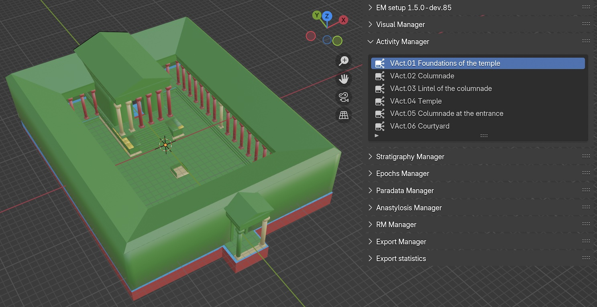
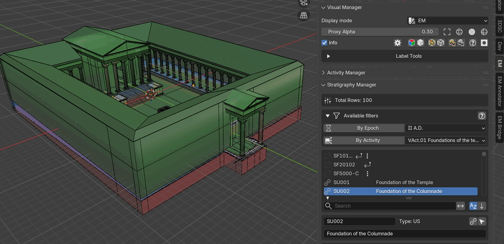

.. _Activity_Manager:

Activity Manager
================

.. seealso::

   In the Extended Matrix language manual:

   - :doc:`em-doc:activity` — concept and modelling rules for activity
     groups (Activity NodeGroup).

.. _EM_Act_ManagerFIG:

   Activity Manager panel

This panel (:numref:`Fig. %s <EM_Act_ManagerFIG>`) lists all the activity groups included in the EM graph file. Activities represent groups of stratigraphic actions that belong to the same constructive or destructive process.

.. _FilterActivityGIF:

   Activity filtering demonstration

Panel Layout
------------

The panel displays a list of activities extracted from the graph's ``ActivityNodeGroup`` nodes. Each row shows:

- The **activity name** with a network icon
- The associated **epoch name** (derived from the graph edge ``has_first_epoch``)

When an activity is selected in the list, it can be used as a filter criterion in the :ref:`Stratigraphy_Manager` panel.

Workflow
--------

**Populating the activity list:**

The activity list is automatically populated when the GraphML file is loaded. Each ``ActivityNodeGroup`` node in the graph is extracted with its name, description, and associated epoch.

**Filtering by activity:**

1. Select an activity in the list
2. In the :ref:`Stratigraphy_Manager` panel, expand the ``Available filters`` section
3. Enable the ``By Activity`` toggle
4. The stratigraphy list will show only the units belonging to the selected activity group

Activity filtering can be combined with epoch filtering. When both are active, only units matching both criteria are shown.

.. seealso::
   The :ref:`filter_system` section in the Stratigraphy Manager documentation for details on how filters interact.
