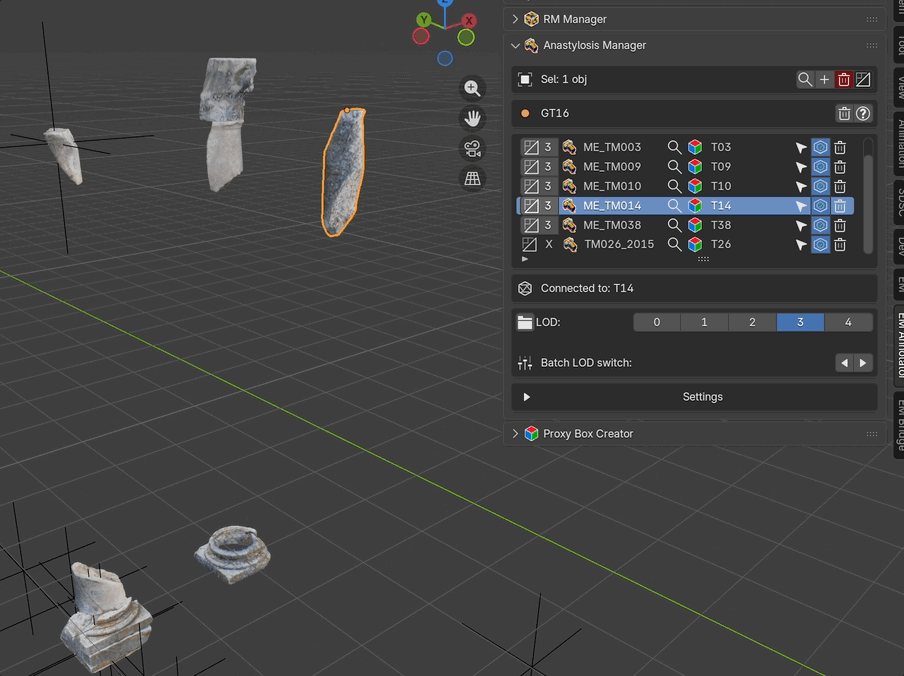

.. _Anastylosis_Manager:
.. _do-anastylosis:

Anastylosis Manager (RMSF)
==========================

.. note::

   **Performing anastylosis with EM Tools**

   Anastylosis — the reassembly of a structure (wall, column, frieze)
   from its scattered or re-used fragments — is a core EM Tools
   workflow. The Anastylosis Manager panel described below lets you
   align 3D-surveyed pieces or drawn-from-source fragments into a
   coherent reconstructive ensemble. Each piece is exposed as a
   **Representation Model Special Find (RMSF)** row carrying two
   orthogonal links: one toward the SpecialFind / Virtual SpecialFind
   node (the *identity* of the fragment across epochs) and one toward
   its source Document (the *paradata / provenance* of the geometry).
   The graph backbone tracks the evidence chain throughout: each
   fragment carries provenance, each alignment is paradata-supported,
   and the final ensemble is publishable as a documented
   reconstruction. See the **Workflow** section below for the
   step-by-step procedure.

The Anastylosis Manager handles **Representation Model Special Find**
(RMSF) meshes — typically photogrammetric or laser-scan models of
movable archaeological objects — and the associations that turn each
mesh into a useful node of the Extended Matrix.

The panel is located in the **EM Annotator** tab.

.. _RMSFGIF:

   RMSF panel demonstration

Why two associations?
---------------------

Each RMSF row carries **two distinct links**, and they live on
**orthogonal axes**:

- **RMSF → SpecialFind (SF / VSF)** is the *temporal / identity* axis.
  A movable object is the same entity even when it changes location,
  orientation, or fragmentation across time. The SF node owns that
  identity; the RMSF mesh is just the geometric snapshot we use to
  render it. Multiple RMSF meshes can therefore point at the same SF, 
  that in turn can be instanced in different epochs with different 
  properties (position, orientation, fragmentation) through the dotted 
  connector that links SFs to each other in the graph
  encodes the **diachronic transformation** of the object (e.g. the 
  fragment of the column found in non origianl position at epoch *N* 
  and the same fragment repositioned in the original position at epoch
  *N-1*).

- **RMSF → Document** is the *paradata / source* axis. The mesh comes
  from a measurement or survey campaign (photogrammetry, laser scan) 
  — its trustworthiness, license, embargo, and the right to
  extract derived information (sections, diameters) all
  hang off the source document. Without this linkage the downstream
  knowledge-extraction tools (Surface Areas, Proxy Box, measurement
  extractors) have no provenance to attach the new paradata to.

In one sentence: the SF link answers *which object* (and *when*); the
Document link answers *where the geometry came from* and *what we are
allowed to do with it*. Each row therefore exposes one picker per
axis.

Panel Layout
------------

**Selection Operations** (top area, visible when objects are selected):

- ``Sel: N obj(s)`` label
- ``Select in List from Active Object`` — highlight the active 3D
  object in the list
- ``Add Selected Objects`` — add selected meshes to the RMSF list
- ``Remove Selected from Anastylosis`` — batch-remove (with
  confirmation)
- LOD batch menu (only when at least one selected object has LOD
  variants)

**Header**:

- Active graph code indicator
- ``Clean Missing Rows`` button — removes list entries whose mesh has
  been deleted from the scene

**Main List** — compact, association-focused row:

::

   [LOD] [RMSF] [name]   [🔍 SF] [SF name | "[---]"]   [🔍 Doc] [Doc name | "[---]"]   [📤 publish]   [🗑 delete]

- **LOD** — current Level of Detail (0–4); click to open the LOD menu.
  ``X`` when the mesh has no LOD variants.
- **RMSF icon + name** — custom icon for healthy rows, ``ERROR`` icon
  when the underlying mesh is missing.
- **🔍 SF** + **SF name** — magnifying-glass opens the SF / VSF
  picker (search by name, or click ``+ New SF`` to create one through
  the shared Add-US dialog with the type **locked to SpecialFind**).
  Placeholder ``[---]`` when no SF is linked.
- **🔍 Doc** + **Doc name** — magnifying-glass opens the Document
  picker (search the catalog or create a new master via
  ``+ Add New Document...``). Placeholder ``[---]`` when no Document
  is linked. The picker writes a ``has_representation_model_doc`` edge
  in the graph, so any tool that reads paradata from the RMSF (Surface
  Areas, Proxy Box) picks the document up automatically.
- **📤 publish** — flag the row for export.
- **🗑 delete** — remove the row (with confirmation).

Scene-selection actions (jump to the SF proxy in the viewport, jump
to the Document in the catalog) live in the **detail panel under the
list**, not on the row itself, to keep the row reserved for
associations.

**Detail Panel** (visible when a row is selected):

- **Chain summary** — ``RMSF → SF → Doc`` with placeholders where
  missing.
- ``Select RMSF`` — select the RMSF mesh in the 3D viewport.
- ``Show Document`` — highlight the linked Document in the
  :ref:`Document_Manager_3D` catalog.
- ``Clear Document`` — drop just the Document association (leaves the
  SF link intact).

**LOD Management** (when the selected item has LOD variants):

- ``Open Linked File`` — open the source ``.blend`` of a linked mesh
- LOD level buttons (0–4) — switch the selected item to a specific LOD
- Batch LOD arrows — shift every item one LOD up or down

**Settings** (collapsible):

- ``Zoom to Selected`` — auto-zoom the viewport on row click

Workflow
--------

1. **Import** the RMSF mesh — a single OBJ, a batch via 3D Survey
   Collection, or a linked ``.blend``.
2. **Position** the mesh anywhere in the scene.
3. **Add to the list** — select the mesh and click
   ``Add Selected Objects``. The row appears with both SF and
   Document showing ``[---]``.
4. **Link to a SpecialFind**.
   - Existing SF / VSF: click 🔍 SF, search, pick.
   - Brand-new SF: click 🔍 SF then ``+ New SF`` — the shared Add-US
     dialog opens with the type pre-selected and **locked** to
     SpecialFind. After confirm the new SF is automatically linked to
     this RMSF row.
5. **(Recommended) Link to a Document** — click 🔍 Doc, search the
   catalog, or click ``+ Add New Document...`` to mint a fresh master.
   Without a Document the RMSF cannot feed Surface Areas / Proxy Box
   knowledge-extraction tools.
6. **(Optional) Switch LOD** — click a LOD number on the row or in
   the detail panel.
7. **(Optional) Mark for export** — toggle the publish flag.

When a Document is later swapped via the same picker, the previous
``has_representation_model_doc`` edge is dropped automatically so the
graph stays consistent.

.. _anastylosis_manager:

Anastylosis Manager Overview
----------------------------

The Anastylosis Manager coordinates reconstructions built from real
fragments (SF) and virtual ones (VSF). Each entry pairs a 3D object
in the scene with both an SF node *and* a Document node, exposing
graph and geometry actions from a single panel.

Typical workflow: promote selected meshes to the list, link them to
the corresponding SF/VSF node and to the source document, switch
between LODs for preview vs. publication, then rely on the Export
Manager to publish the linked scene together with the paradata.

.. _anastylosis_target:

Anastylosis Target (SF / VSF)
-----------------------------

The **target** of the SF axis is the SpecialFind (SF) or Virtual
SpecialFind (VSF) node the 3D object represents.

- **SF** — a real fragment found on site.
- **VSF** — a hypothetical fragment introduced during reconstruction.

The connection is materialised by a ``has_representation_model`` edge
between the SF / VSF node and the RMSF node (the list entry). From
the row you can search the graph (🔍 SF) or create a new SF (``+ New
SF``); the detail panel below the list lets you select the RMSF mesh
in the viewport.

The Document axis is independent and uses
``has_representation_model_doc`` — same edge type the RMDoc panel uses
for spatialised document quads. This keeps the doc-specific paradata
chain visually distinct from the temporal SF chain inside yEd /
GraphML viewers.

.. _anastylosis_fragments:

Anastylosis Fragments (LOD)
---------------------------

Each RMSF can have multiple LOD variants (LOD0 … LOD3). When LODs are
detected, the panel shows a row of LOD buttons:

- Click a number to swap the active LOD for the selected item.
- Use the batch arrows to shift **all** items one LOD level up or
  down at once, keeping the reconstruction coherent.
- ``Open Linked File`` jumps to the source ``.blend`` when the mesh
  is linked from a library.

LOD switching preserves transforms, materials and graph connections;
only the mesh data-block is reassigned.
