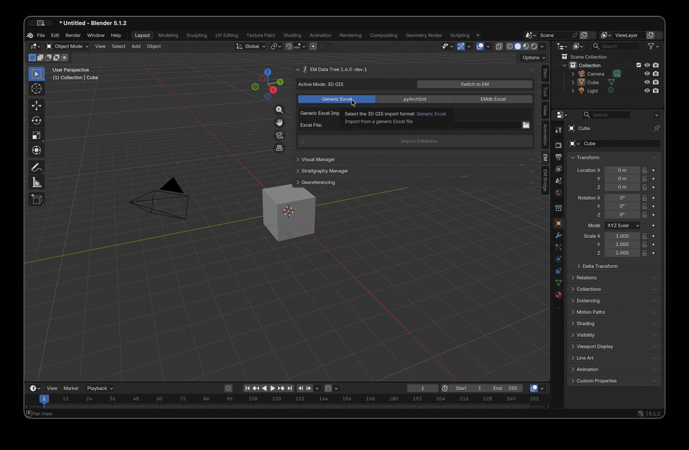
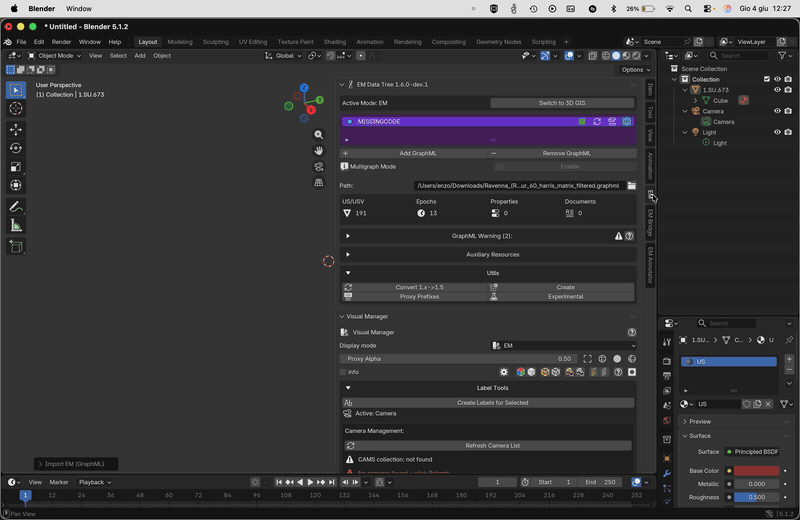

.. _EMsetup:

EM Data Tree
============

.. seealso::

   In the Extended Matrix language manual:

   - :doc:`em-doc:index` — overview of the formal notation feeding the
     ``.graphml`` files loaded here.
   - :doc:`em-doc:em_workspace_preparation` — DosCo folder layout and
     iteration pattern (see also :ref:`em-doc:enrich-dosco-iterative`).

.. _EMsetupFIG:

.. figure:: ../img/EMsetup.png
   :width: 400
   :align: center

   EM Data Tree Panel

This panel (:numref:`Fig. %s <EMsetupFIG>`)  allows to create the first connection between Blender and the Extended Matrix (.graphml file).
Press the ``Add GraphML`` and locate the ``.graphml`` file wiin the ``Path`` section (**NB**: before closing the path window remember to uncheck ``relative path`` within the settings.
Alternatively, it is possible to paste the entire path within the empty line).

.. _EMsetup_02FIG:

.. figure:: ../img/EMsetup_02.png
   :width: 400
   :align: center

   GraphML import

When a GraphML is loaded (:numref:`Fig. %s <EMsetup_02FIG>`), on the left side of the EM Data Tree window the GraphML ID will appear (for example, the ID: GT16).
On the same line, on the right side, a green square will show up.
The green color cofirms that a connection between the GraphML and EMtools has been established.

.. note::

   To correctly link the ``.graphml`` file with the ``EM Data Tree`` panel it is mandaotry to insert, at least, the GraphML ID on the title of the ``Swimlane node`` (**1.5 dev4 palette**); the first node that needs to be imported in the yEd space to start the creation of an Extended Matrix (:numref:`Fig. %s <EM_TITLEFIG>`).

   Example:

   Context name [ID:xx;ORCID:xx;LICENSE:CC-BY-ND]

   Great Temple [ID:GT16;LICENSE:CC-BY-ND]

   .. _EM_TITLEFIG:

   .. figure:: ../img/EM_TITLE.png
      :width: 400
      :align: center

      EM graphml file title example

Next to the green (or red) square, three buttons complete the right side of the line (:numref:`Fig. %s <EMsetup_02FIG>`): the ``Update`` button allows to refresh the ``.graphml`` file, if changes have been applied on the EM graph during the modelling session; the ``Activate EM`` button consent to explore only the selected GraphML; and the ``pubblish`` button appears when the multigraph mode is enabled.

This version of EMtools allows to activate the ``Multigraph Mode``, this option consent to upload and visualize multiple graphs.
To upload a new graph and explore its information user can follow all the steps already explained.

.. note::

  This version of EMtools include **info boxes**.
  When the info button is selected an info box will appears with more information related to that specific part of the tool.

   .. _EM_info_buttonFIG:

   .. figure:: ../img/EM_info_button.png
      :width: 400
      :align: center

      Example of EM info box

Once the connection has been established, EMTools will summarize the most important information (US/USV; Epochs; Properties; Sources) within a simple table under the ``Path`` section (:numref:`Fig. %s <EMsetup_02FIG>`).

The ``Remove GraphML`` button allows to remove one or more EMs from the EM Data Tree list.

.. _em-tools-aux-load:

.. note::

   **Loading DosCo documents into the graph**

   The panel commands described below load documents from your DosCo
   folder into the EM graph as nodes. The link between the file on
   disk and the graph node is preserved; if you re-iterate your
   DosCo (add new entries, update existing ones), reload from this
   panel to surface the changes. For the DosCo concept, folder layout
   and iteration pattern, see :ref:`Iterating the DosCo
   <em-doc:enrich-dosco-iterative>` in the Extended Matrix language manual.

In this panel (:numref:`Fig. %s <EMsetup_02FIG>`) users can also link the path to the *DosCo* folder, where sources are stored.
To locate sources, users must follow the same guidelines previously outlined for the localization of the EM file.

If the EM graph presents a connection with and external database, EMTools allows to import databases to maintain data connection also within Blender.

To establish the connection with EMtools:

- expand the ``Auxiliary files`` section and press ``Add``;
- select the type (Generic Excel, PyArchInit, EMdb Excel);
- indicate the exact location of the Auxiliary file and click on the ``Accept`` button.

.. note::
   When **EMdb Excel** type is selected a ``Format`` menu appears, select the correct format from the list.

.. _aux-files-concept:

Auxiliary files — concept
~~~~~~~~~~~~~~~~~~~~~~~~~

Auxiliary files are **not** part of the EM graph's core structure.
The graph (``.graphml``) defines stratigraphy, proxies, sources and
their logical relations; auxiliary files provide *additional,
tabular* information that EMtools attaches to existing graph nodes
at import time. They live outside the graph and can be re-imported,
re-mapped or detached without altering the topology of the
reconstruction.

The three currently supported auxiliary types behave the same way
conceptually but differ in their source format:

- **Generic Excel** — any ``.xlsx`` with a header row; mapping is
  defined by the user.
- **pyArchInit** — a pyArchInit SQLite database; mapping is
  pre-configured for the pyArchInit US table (see
  :doc:`/tutorials/15-pyarchinit-external-data`).
- **EMdb Excel** — a tabular database structured according to the
  *EMdb* conventions; mapping is driven by a **JSON mapping file**
  (see :ref:`aux-json-mapping` below).

.. important::

   Auxiliary files in this sense (tabular data attached at import
   time via a mapping) must not be confused with **auxiliary
   stratigraphic nodes** in the EM language — *Continuity* and
   related node types that belong to the formal notation. The
   former is a *data plumbing* feature of EMtools; the latter is a
   *modelling primitive* of the language. See the EM language
   manual for the latter.

Typical use cases:

- enrich existing US/USV nodes with material qualia, dating
  ranges, excavator notes that live in a separate spreadsheet;
- link photo paths and metadata to stratigraphic units without
  redrawing the graph in yEd
  (see :ref:`link-photos-aux` for the step-by-step procedure);
- merge field-database records (pyArchInit) into an already
  authored graph.

.. _aux-json-mapping:

JSON mapping template
~~~~~~~~~~~~~~~~~~~~~

For the **EMdb Excel** (and **Generic Excel**) auxiliary types,
EMtools consumes a JSON mapping file that declares how each column
of the spreadsheet should be projected onto graph properties.
A minimal mapping has the following shape:

.. code-block:: json

   {
     "version": "1.0",
     "sheet_name": "Stratigraphy",
     "start_row": 2,
     "id_column": "A",
     "mappings": [
       {"column": "A", "target": "human_id",      "type": "identifier"},
       {"column": "B", "target": "node_type",     "type": "node_type"},
       {"column": "C", "target": "epoch",         "type": "epoch"},
       {"column": "D", "target": "material",      "type": "qualia"},
       {"column": "E", "target": "photo_path",    "type": "document_link"}
     ]
   }

Each row of the spreadsheet (from ``start_row`` onward) is matched
against an existing graph node via ``id_column``. For each entry
in ``mappings``, EMtools writes the value of the indicated column
onto the target property of the matched node (or creates the
property if absent). Supported ``type`` values mirror the kinds of
data the EM language recognises (``identifier``, ``node_type``,
``epoch``, ``qualia``, ``document_link``, …); the exact list
depends on the importer in use and is documented alongside the
operator in :doc:`/api_reference`.

.. todo::

   Ship a canonical ``emdb_mapping.template.json`` next to the
   addon and reference it here once finalised. Until then the
   shape above is the reference; live working examples can be
   inspected in the *Basilica Iulia* dataset used by
   :doc:`/tutorials/16-mapping-tool-excel`.

.. seealso::

   - :doc:`/tutorials/16-mapping-tool-excel` — bulk import via the
     JSON mapping tool, end-to-end on a 2 000+ row dataset.
   - :doc:`/tutorials/15-pyarchinit-external-data` — pyArchInit as
     auxiliary file (live link to the field database).
   - :ref:`link-photos-aux` — link photos as auxiliary files.

Starting from version 1.5, EMtools allows to link external resource folders containing photos, 3D scans, documents and other media files to your Extended Matrix project.
This feature is particularly useful when working with large image collections that need to be referenced and previewed directly from within Blender.

Setting Up Resource Folders
----------------------------

To link a resource folder to your Extended Matrix:

1. Expand the ``Auxiliary files`` section in the EM Data Tree panel

2. Select an existing auxiliary file or press ``Add`` to create a new one

3. In the ``Resources:`` field, click the folder icon and navigate to your media folder

4. **Important**: Before confirming the path, make sure to check the ``Relative Path`` option in the file browser settings

.. warning::

   Always use **relative paths** when setting up resource folders!

   - Correct: ``//Resources`` or ``//../../SharedFolder/Photos``
   - Wrong: ``C:\Users\YourName\Project\Resources`` (Windows-specific)
   - Wrong: ``/Users/yourname/Project/Resources`` (macOS-specific)

   Relative paths ensure that your project works correctly when:

   - Opening the file on different computers
   - Syncing through cloud services (OneDrive, Dropbox, Google Drive)
   - Sharing the project with collaborators
   - Moving the project to a different location

If a warning appears in red indicating that the path is absolute, reconfigure the path using the relative format.

The Thumbnail System
---------------------

Once a resource folder is configured, EMtools can automatically generate thumbnail previews of all images in that folder.
The thumbnail system creates a local cache that speeds up image browsing and reduces memory usage.

**How it works:**

- Thumbnails are stored in a folder named ``EM_thumbs/`` next to your ``.blend`` file
- Each resource folder gets its own subfolder (e.g., ``Resources_abc12345``)
- The system remembers which images have been processed to avoid duplicates
- If you sync your project via cloud storage, thumbnails are automatically shared across computers

Generating Thumbnails
----------------------

1. In the Auxiliary Files panel, locate the text ``Thumbnails for the resource folder? Click below.``

2. Click the ``(Re)generate thumbnails`` button

3. EMtools will scan all images in the resource folder (including subfolders) and create previews

4. Progress information is displayed in the Blender console

5. The line ``Thumbs: Resources_xxxxxxxx`` shows the name of the cache folder that was created

.. note::

   Supported image formats: JPG, PNG, BMP, TIFF, PDF (first page)

   The generation process only creates thumbnails for new or modified images.
   If you click ``(Re)generate`` again, existing thumbnails are skipped automatically.

Viewing Thumbnail Cache
-------------------------

You can verify that thumbnails were created correctly:

- The ``Thumbs: Resources_xxxxxxxx`` line displays the cache folder name
- Click the folder icon next to this line to open the cache folder in your file manager
- Inside you'll find the ``index.json`` file and thumbnail images organized in subfolders

Using Thumbnails in EMtools
-----------------------------

Once thumbnails are generated, they are automatically displayed when:

- Browsing DocumentNodes linked to images
- Using the US/USV Manager to view associated documentation
- Working with the Stratigraphy visualization tools

The thumbnail preview provides quick access to your images without having to open them in external applications.

Working Across Multiple Computers
-----------------------------------

If you use cloud storage to sync your project:

1. **First computer**: Set up resource folders using relative paths and generate thumbnails

2. Wait for cloud sync to complete (the ``EM_thumbs/`` folder will be uploaded)

3. **Second computer**: Open the same ``.blend`` file

4. Thumbnails are automatically recognized and ready to use - no need to regenerate them!

.. tip::

   If you work on multiple computers, make sure that:

   - The ``.blend`` file and resource folders maintain the same relative structure
   - Cloud sync is complete before opening the project
   - You always use the ``//`` prefix for relative paths

Best Practices
----------------

- **Keep resources organized**: Use clear folder names like ``Photos``, ``3DScans``, ``Documents``
- **Generate thumbnails periodically**: After adding many new images, regenerate to update the cache
- **Check the hash**: The ``Thumbs: Resources_xxxxxxxx`` code should be identical on all your computers if using relative paths
- **Backup regularly**: Include both the ``.blend`` file and the ``EM_thumbs/`` folder in your backups

.. note::

   For more advanced usage and technical details about the thumbnail system, click the help icon (?) next to the ``Thumbs:`` line in the interface.

Troubleshooting
-----------------

**Thumbnails not appearing**
   - Verify that the resource folder path is correct and accessible
   - Click ``(Re)generate thumbnails`` to rebuild the cache
   - Check the Blender console for error messages

**Warning about absolute path**
   - Reconfigure the resource folder using a relative path with ``//`` prefix
   - Example: change ``C:\Project\Resources`` to ``//Resources``

**Different cache folder on another computer**
   - This happens when using absolute paths instead of relative paths
   - Solution: reconfigure all resource folders using relative paths
   - The hash (``Thumbs: Resources_xxxxxxxx``) should match across computers

**Thumbnails folder not syncing**
   - Check that your cloud storage service is actively syncing the ``EM_thumbs/`` folder
   - Some cloud services may need manual folder selection for sync

Utils sub-panel
---------------

A third section, the ``Utils`` sub-panel (labelled *Utilities & Settings*
in older builds), is included within the EM Data Tree panel.
Here, users can: convert an EM made with an old version of the formalism,
create the default collections, rename Proxies and enable Experimental
Features.

In the first case (``Convert 1.x->1.5`` button) EMtools will normalise
older GraphML files authored with the 1.x palette to the 1.5 visual
conventions — see :ref:`convert-legacy-em-graph` below for details.

Within this section, EMtools includes also a button, ``Create Standard Collections``, that allows to automatically create the set of default collections (Proxy, RM, CAMS) related to a reconstruction process with Extended Matrix.

By pressing ``Manage Proxies' Prefixes`` button, EMtools will automatically rename Proxies according to the GraphML ID (**NB**: this step is mandatory to mutually connect GraphML and Proxies. User must select geometries before applying the tool).

By pressing the ``Enable Experimental Features`` button, a set of Experimental Features will be activated within the sections of the EM Data Tree panel (:numref:`Fig. %s <EMsetup_03_editFIG>`).

.. _convert-legacy-em-graph:

Convert 1.x->1.5
~~~~~~~~~~~~~~~~

The ``Convert 1.x->1.5`` button in the EM Data Tree → **Utils**
sub-panel migrates older Extended Matrix GraphML files (authored
with the 1.x generation of the yEd palette) to the **1.5** visual
conventions used by the current importer and tooling.

What it does
^^^^^^^^^^^^

The button drives the ``graphml.convert_borders`` operator, which
reads a ``.graphml`` file and rewrites its node visual attributes
in-place on a new file:

- Sets the **border width** to ``4.0`` for the EM target shapes
  (rectangle, hexagon, ellipse, octagon, parallelogram).
- Applies the **1.5 canonical border colours** based on shape type
  and background:

  - rectangle → ``#9B3333`` (US / negative units)
  - hexagon → ``#31792D`` (USV)
  - ellipse → ``#31792D`` (USV variants)
  - parallelogram → ``#248FE7`` (documents / extractors)
  - octagon → ``#D8BD30`` (Special Find) when on a light background,
    ``#B19F61`` (Virtual Special Find) when on a black background.

The result is written next to the original file with a
``_converted.graphml`` suffix; the source file is left untouched.

How to use
^^^^^^^^^^

1. Expand the ``Utils`` sub-panel in the EM Data Tree.
2. Click ``Convert 1.x->1.5`` — Blender's file browser opens.
3. Select the legacy ``.graphml`` file and confirm. EMtools
   produces ``<name>_converted.graphml`` in the same folder and
   reports the output path in the Blender status bar.
4. Load the converted file with ``Add GraphML`` as you would any
   other graph (see the *Loading DosCo documents into the graph*
   note above for the load workflow).

What it does NOT do
^^^^^^^^^^^^^^^^^^^

The operator is a **visual / palette normaliser**, not a full
datamodel migration. In particular:

- It does not invent or upgrade paradata. If the older graph lacked
  ``family`` / ``is_series`` attributes on extractors and combiners,
  the converted file reflects the same absence.
- It does not rename relation edges whose semantics changed between
  releases (e.g. ``is_after`` direction canonicalisation introduced
  in v1.5.3). Such edges are preserved as-is and may surface as
  importer warnings.
- It does not re-link external documents. DosCo references in the
  original are preserved as identifiers; ensure the corresponding
  files are reachable in your DosCo folder.
- For projects authored **before EM 1.0** (pre-formalisation,
  free-form yEd), conversion is not reliable: the original is best
  used as a visual reference for manually rebuilding the graph in
  the current palette.

For the missing pieces above, the importer side picks up some of
the slack: ``s3dgraphy.importer.import_graphml`` is forgiving on
older label conventions and re-maps known legacy types on the fly
during import, and the post-import passes in ``s3dgraphy.transforms``
(``hoist_propagative_metadata``, ``prune_redundant_propagative_edges``,
``compact_propagative_metadata``) can be used to normalise paradata
attribution programmatically.

Roadmap
^^^^^^^

A single, end-to-end ``s3dgraphy.utils.convert_legacy_em_graph``
wrapper that combines the palette-normalisation step performed by
this button with the in-memory cleanup transforms is on the
s3dgraphy roadmap. Until it lands, the procedure above (button →
load → optional transforms → re-export) is the recommended path.
The anchor for this section (``convert-legacy-em-graph``) is
stable and will continue to point here when the wrapper is
published.

.. _EMsetup_03_editFIG:

.. figure:: ../img/EMsetup_03_edit.png
   :width: 400
   :align: center

   Experimental Features enabled (red rectangles with numbers 1-3)

.. note::

   As highlighted in the red warning, this set of features is experimental and it should not be used within the regular documentation process of the EM (:numref:`Fig. %s <EMsetup_03_editFIG>`).

Here a brief presentation of the Experimental Features, the numebers on the list refer to the numbers specified in :numref:`Fig. %s <EMsetup_04abcFIG>`:

1. On the upper part of the panel the ``Switch to 3D GIS`` button allows to instantly switch from the ``EM mode`` to a ``3D GIS mode`` where users can link an external database to EMtools (:numref:`Fig. %s <EMsetup_04abcFIG>`). The activation of the ``3D GIS mode`` consents to connect an External database to the 3D environment of Blender via EMtools. User have three different type of external databases (*Generic Excel*, *PyArchInit*, *EMdb Excel*) to choose from. By pressing the corresponding button a diverse set of options will appear. After setting all the required information the external db will be import within EMtools.

2. Within the ``DosCo Folder`` section (:numref:`Fig. %s <EMsetup_03_editFIG>`) the ``More option`` menu appears, this new part of the add-on permits to populate Extractors, documents and Combiners using DosCo files.

3. In the ``Utilities & Settings`` (:numref:`Fig. %s <EMsetup_03_editFIG>`) the activation of the ``Enable Experimental Features`` button activates the ``Experimental Tools`` section with ``Rebuild Graph Indices``, ``Benchmark Property Functions``, and the collapsible **Create a GraphML** wizard.

   - **Create a GraphML**: A 3-step panel-based wizard for generating Extended Matrix GraphML files from Excel data — either filled manually using downloadable templates or produced by AI-assisted extraction from archaeological reports. The wizard works entirely in memory until export:

     - **Step 1 — Convert Stratigraphy**: Loads ``stratigraphy.xlsx`` (24-column template) and creates an s3dgraphy graph in memory.
     - **Step 2 — Enrich with Paradata** (optional): Loads ``em_paradata.xlsx`` and adds per-property provenance chains (PropertyNode → ExtractorNode → DocumentNode) to matching nodes.
     - **Step 3 — Export GraphML**: Saves the graph to a ``.graphml`` file. Import this file via **File > Import EM file** to populate the Blender scene.

     The panel also provides **template download** buttons and an **AI Extraction Prompt** section with a language selector and a one-click **Copy AI Prompt to Clipboard** button.

     **Warning**: This feature is experimental. Always verify the generated GraphML before using it in production.

.. _EMsetup_04abcFIG:

.. figure:: ../img/EMsetup_04abc.jpg
   :width: 400
   :align: center

   3D GIS mode

.. _pyarchinit_row_filtering:

Row Filtering (3D GIS Import, 1.6+)
-----------------------------------

When importing data from a PyArchInit SQLite database (and other
mapped tabular sources) through the 3D GIS mode, EMtools can filter
rows on the fly so you import only the subset you care about —
for example, one archaeological site at a time instead of every
site recorded in the database.

This works by reading the ``is_filter`` flags in the mapping JSON
file you select. For each column the mapping marks as filterable,
EMtools queries the database for the distinct values present and
populates a dropdown in the 3D GIS panel.

.. seealso::

   `s3dgraphy mapping JSON authoring — Filterable columns
   <https://docs.extendedmatrix.org/projects/s3dgraphy/en/latest/importers/mapping_schema.html#filterable-columns-is-filter>`_
   — how to mark a column as filterable when writing a mapping file
   (the producer-side view of the same feature).

When the dropdowns appear
~~~~~~~~~~~~~~~~~~~~~~~~~

After you select, in the 3D GIS panel:

1. A **database file** in the ``DB`` field (the
   ``pyarchinit_db_path`` property), and
2. A **mapping** (for example ``pyarchinit_us_mapping``),

EMtools reads the mapping, finds columns marked ``is_filter: true``,
and renders a box titled **"Filter rows by:"** with one dropdown
per filterable column. If the mapping has no filter columns the box
does not appear and the panel behaves exactly as in 1.5.

Up to **5 filter columns** per mapping are supported. Beyond that
limit the extra columns are silently ignored.

Required vs optional filters
~~~~~~~~~~~~~~~~~~~~~~~~~~~~

A dropdown whose label ends with an asterisk (for example
``Site *``) is **required**: you must pick a specific value before
importing. The ``(All values)`` placeholder is absent for these.

A dropdown without an asterisk is **optional**: choose
``(All values)`` to skip it (no filter applied on that column), or
pick a specific value to constrain the import.

Multiple filters combine with logical **AND**. For example, picking
``Site = Pompei`` and ``Area = A`` imports only rows where both
conditions match.

Values are matched **exactly** — case-sensitive string equality.
There are no wildcards, ranges or multi-select.

What happens at import time
~~~~~~~~~~~~~~~~~~~~~~~~~~~

Click **Import**. EMtools collects your dropdown choices into a
``filters`` dictionary and passes it to the importer:

- If a required filter was left at ``(All values)``, the import is
  aborted with an error message — pick a concrete value and retry.
- If all required filters are set, the importer issues a SQL query
  with a ``WHERE`` clause built from your selections
  (parameterised, so the values are safely escaped).
- Only rows matching the filters become nodes in the resulting
  graph; everything else stays in the database, untouched.

Caching
~~~~~~~

Distinct values for a filter column are queried lazily, the first
time the dropdown is opened, and **cached** keyed on
``(file path, file mtime, column name)``. Re-opening the dropdown
is therefore instant; changing the file on disk invalidates the
cache on the next read.

If you change the database **path** or the **mapping** in the
panel, EMtools resets all 5 filter slots and re-discovers the
filterable columns from scratch.

Limits and edge cases
~~~~~~~~~~~~~~~~~~~~~

- Filtering applies to the **3D GIS import path** (the main
  ``pyarchinit_db_path`` field shown in the 3D GIS panel). The
  **auxiliary-files** import path described in
  :ref:`aux-files-concept` does **not** show filter dropdowns in
  1.6 — it still imports the whole table.

- If the mapping declares a filter column but the database table
  is **missing that column**, the dropdown shows an error message
  and the import is aborted. Fix the mapping (or the database
  schema) and retry.

- Filtering does not affect **relations** resolution: if you filter
  out US #42 but US #38 has a relation pointing to #42, the
  relation is dropped because the target sits outside the imported
  subset. Workarounds: include both ends of the relation in your
  filter, or re-import with a broader filter and prune the result
  externally.

Example — importing only one site
~~~~~~~~~~~~~~~~~~~~~~~~~~~~~~~~~

Importing only the *Pompei* site from a multi-site PyArchInit
database:

1. Open the 3D GIS import panel (see :ref:`EMsetup_04abcFIG`).
2. Set **DB** to your ``pyarchinit.db`` file.
3. Set **Mapping** to ``pyarchinit_us_mapping`` — a mapping that
   marks ``sito`` as ``is_filter: true`` and
   ``filter_required: true``.
4. The **"Filter rows by:"** box appears with one dropdown,
   labelled ``Site *``.
5. Open the dropdown — EMtools queries the database and shows
   ``Ercolano``, ``Pompei``, ``Stabia``.
6. Pick ``Pompei``.
7. Click **Import**. Only the *Pompei* US records are loaded into
   the graph; the other sites remain in the database, ignored by
   this import.

.. _pyarchinit_postgres_backend:

PostgreSQL / PostGIS backend (3D GIS Import, 1.6+)
--------------------------------------------------

Starting with **EM Tools 1.6**, the pyArchInit 3D GIS import path
can read directly from a **live PostgreSQL / PostGIS database** in
addition to the historical SQLite file mode. This is the backend
real archaeological projects use in the field — multi-user editing,
QGIS-friendly geometry storage, server-side backups — so connecting
to it without exporting a SQLite snapshot first removes a whole step
from the daily authoring loop.

.. admonition:: Scope — 3D GIS mode only (for now)
   :class: important

   Everything described in this section applies specifically to the
   **3D GIS mode** of the EM Setup panel (the ``Switch to 3D GIS``
   workflow described above). In **pure EM mode** the data
   ingestion goes through a different code path that does not yet
   use the PostgreSQL/PostGIS backend introduced here — pure-EM
   projects still consume their source data through the existing EM
   importers. Bringing the same backend into pure EM mode is on the
   roadmap but is **not** part of this release. Until then, the
   one-click "live database" experience is a 3D GIS feature.

.. admonition:: Contributed by Enzo Cocca
   :class: note

   The PostgreSQL / PostGIS backend was contributed by **Enzo Cocca**
   (`@enzococca <https://github.com/enzococca>`__) via
   `EM-blender-tools PR #28
   <https://github.com/zalmoxes-laran/EM-blender-tools/pull/28>`__,
   landing the *Sub-2* milestone of the umbrella tracking
   `issue #27 <https://github.com/zalmoxes-laran/EM-blender-tools/issues/27>`__
   (*PyArchInit Postgres backend + reverse export*). The companion
   piece on the s3dgraphy side is
   `s3dgraphy PR #12 <https://github.com/zalmoxes-laran/s3Dgraphy/pull/12>`__.

   *Connecting EM Tools 1.6 to a live pyArchInit PostgreSQL database
   and importing 3D-GIS data without an intermediate SQLite export.
   Credit: Enzo Cocca.*

Switching to PostgreSQL mode
~~~~~~~~~~~~~~~~~~~~~~~~~~~~

In the 3D GIS panel (see :ref:`EMsetup_04abcFIG`) the connection
source is now a two-way switch: **SQLite | PostgreSQL**.

- **SQLite** — the historical behaviour. A ``.sqlite`` file is read
  through the existing reader; nothing changes for projects that
  rely on a local SQLite export.
- **PostgreSQL** — new in 1.6. The panel expands to show connection
  fields for a live PostgreSQL / PostGIS server.

When PostgreSQL is selected, the following fields appear:

.. list-table::
   :header-rows: 1
   :widths: 22 78

   * - Field
     - What to put in it
   * - **Host**
     - The PostgreSQL server hostname or IP (for example
       ``db.example.org`` or ``localhost``).
   * - **Port**
     - The TCP port the server listens on (default ``5432``).
       Leave empty to use the default.
   * - **Database**
     - The database name that holds the pyArchInit schema
       (typically ``pyarchinit_db`` or a project-specific name).
   * - **User**
     - The PostgreSQL role to authenticate as. Must have at least
       **SELECT** on the pyArchInit US table and the geometry table —
       the read path is forced read-only at the connection level, so
       no other grants are required for import.
   * - **Password**
     - The password for the role. Stored *only in memory* and never
       written to the ``.blend`` file (see :ref:`pg-security` below).
   * - **Schema**
     - Optional PostgreSQL schema name if the pyArchInit tables live
       outside ``public``. Leave empty to use the server's
       ``search_path``.

The **Mapping** picker, the **Filter rows by:** dropdowns, and the
**Import** button keep working exactly as in
:ref:`pyarchinit_row_filtering` — row filtering is backend-agnostic
and applies to PostgreSQL imports too. The SQL ``WHERE`` clause is
still parameterised on the server side.

.. _pg-password-keychain:

Saving the password to the OS keychain
~~~~~~~~~~~~~~~~~~~~~~~~~~~~~~~~~~~~~~

Typing the database password every time is tedious for production
projects, so the panel exposes two extra controls next to the
**Password** field:

- **Save to keychain** — stores the password in the operating
  system's native credential store (macOS Keychain, GNOME Keyring,
  Windows Credential Manager). The next time you open Blender and
  switch to PostgreSQL mode, the password field is auto-populated
  from the keychain.
- **Forget** — removes the credentials from the keychain.

If the host platform has no working keychain backend (a typical
case is a headless Linux build of Blender), the password lives only
in memory for the current Blender session: it works for the next
import but is forgotten when Blender exits. The panel surfaces a
short message when this happens, so you know to retype the password
on the next session rather than wondering why **Save to keychain**
appeared to do nothing.

.. _pg-security:

Security posture
~~~~~~~~~~~~~~~~

A few facts about how the new backend treats credentials. None of
these require any configuration on your side — they are how the
code is written — but they are worth knowing if you are deploying
EM Tools on shared lab machines or sharing ``.blend`` files
between collaborators:

- The password field is declared with Blender's ``SKIP_SAVE`` flag
  and ``subtype='PASSWORD'``. Effect: **the password is never
  serialised into the ``.blend`` file**, even if you tick
  *Save to keychain* and then save the scene. Reopening the
  ``.blend`` on another machine starts with an empty password
  field.
- The connection URL is **percent-encoded** before being passed to
  the PostgreSQL driver. Special characters in passwords
  (``@``, ``/``, ``:``, ``?``, …) cannot corrupt the URL or be
  mis-parsed.
- Whenever EM Tools writes provenance attributes onto imported
  nodes (the ``source_file`` field that records *where this US came
  from*), the connection string is **redacted** — both the user and
  the password are stripped before persistence. The graph keeps a
  readable database hint (``postgres://<redacted>@db.example.org/pyarchinit_db``)
  without ever embedding credentials.
- Connection failures **deliberately do not include the connection
  URL** in their error popups, so screenshotting a stack trace
  cannot leak the password.
- The connection is opened **read-only** with ``autocommit=on``
  (a server-side guarantee, not just a client convention), so even
  a bug in EM Tools cannot accidentally write to the pyArchInit
  database during a 3D GIS import.

What this does *not* protect against is a malicious local user with
filesystem access to your home directory and the OS keychain —
that's the operating system's problem, not the addon's. If your
threat model includes that scenario, do not use *Save to keychain*;
just retype the password every session.

Switching between PostgreSQL and SQLite
~~~~~~~~~~~~~~~~~~~~~~~~~~~~~~~~~~~~~~~

The two backends coexist: at any moment exactly one source is
active in the 3D GIS panel. Switching from one to the other:

- Resets the panel state cleanly. Row-filter dropdowns are
  re-discovered against the new source on the next mapping or
  filter expansion.
- Does **not** modify the graph that is already loaded in the
  scene. Switching the source picks the data for the *next* import;
  it does not delete anything that was already imported.

A pragmatic recipe: keep a SQLite export of last week's snapshot
alongside the live PostgreSQL connection. Reproducing a result on
an archived snapshot is then a one-click backend switch.

.. _pyarchinit_reverse_export:

Reverse export to PyArchInit DB (Export panel, 1.6+)
----------------------------------------------------

EM Tools 1.6 also includes the **write** side of the PyArchInit
connection: an *Export to PyArchInit DB* provider in the Export
panel that pushes the active EM graph back into the database (SQLite
or PostgreSQL), via ``s3dgraphy.sync.GraphIngestor``. A **dry-run
preview** reports the planned inserts, updates and conflicts before
any data is written.

.. admonition:: Scope — runs in EM Advanced mode (reuses the 3D GIS connection)
   :class: important

   The reverse export lives in the **EM Advanced workflow**: you have
   a full s3dgraphy graph loaded in the scene (typically authored in
   yEd via GraphML and refined inside Blender), and you push it back
   to the PyArchInit database. The connection settings themselves
   (host / port / database / user / password / keychain) are
   **shared** with the 3D GIS import panel described in
   :ref:`pyarchinit_postgres_backend` above — so a round-trip reads
   and writes the same PyArchInit DB with one configuration. You
   import geometries into the scene via the *3D GIS mode* panel and
   you write the enriched graph back via the *EM Advanced mode*
   Export panel; the credentials don't get re-asked in between.

   Pure 3D GIS mode (without an EM graph in the scene) does not have
   a reverse-export surface — there's no graph to push. The
   unification of import + export under a single workflow mode is
   on the roadmap; until then this is the EM-Advanced-with-shared-3D-GIS-credentials
   shape.

.. admonition:: Contributed by Enzo Cocca
   :class: note

   The reverse-export provider was contributed by **Enzo Cocca**
   (`@enzococca <https://github.com/enzococca>`__) via
   `EM-blender-tools PR #29
   <https://github.com/zalmoxes-laran/EM-blender-tools/pull/29>`__,
   landing the *Sub-3* milestone of the umbrella tracking
   `issue #27 <https://github.com/zalmoxes-laran/EM-blender-tools/issues/27>`__
   (*PyArchInit Postgres backend + reverse export*). The companion
   piece on the s3dgraphy side is
   `s3dgraphy PR #11 <https://github.com/zalmoxes-laran/s3Dgraphy/pull/11>`__
   (``s3dgraphy.sync.GraphIngestor`` move) plus the upstream-gap
   follow-up tracked in
   `s3dgraphy #15 <https://github.com/zalmoxes-laran/s3Dgraphy/issues/15>`__.

   *Pushing the active EM graph back into a PyArchInit database
   from the Export panel — dry-run preview first, then the actual
   write. Credit: Enzo Cocca.*

Where the panel lives
~~~~~~~~~~~~~~~~~~~~~

Open the **Export** sidebar tab in the EM Tools UI. The new
**PyArchInit DB** section sits alongside the existing Heriverse,
Tabular and RDF export providers. Two controls (besides the
connection inherited from the 3D GIS import panel):

- **Site** — the PyArchInit site name (``sito``) the graph rows
  are written under. Required.
- **Create missing epochs** — when on, the export auto-creates
  ``periodizzazione_table`` rows for any EM epochs that are not
  already present in the PyArchInit DB. When off, an unknown
  epoch is reported as a conflict and the row containing it is
  skipped.

Two action buttons:

- **Preview (dry run)** — runs the ingestor in read-only mode and
  reports planned inserts / updates / conflicts. Never mutates the
  database. Recommended as the first step of any reverse export.
- **Export to PyArchInit DB** — the real write. Wraps the same
  ``populate_list`` call but with ``dry_run=False``. The summary
  popup is the same shape as the dry-run, with the actual
  applied-row counts instead of the planned ones.

The ``node_uuid`` prerequisite
~~~~~~~~~~~~~~~~~~~~~~~~~~~~~~

``s3dgraphy.sync.GraphIngestor`` matches s3dgraphy nodes to
PyArchInit rows by ``node_uuid``, a column that the database
must carry on the three reverse-export-target tables
(``us_table``, ``inventario_materiali_table``,
``periodizzazione_table``). On a recently-updated PyArchInit
install, the column is already there. On an older install, the
export operator handles the gap:

- **Preview (dry-run) path** — never mutates the schema. If the
  column is missing, the popup explains how to bring the
  database up to date from the PyArchInit side and aborts.
- **Real-export path** — attempts a best-effort, idempotent
  migration (``add node_uuid`` + partial unique index + UUID
  backfill, via SQLAlchemy, SQLite and PostgreSQL both
  supported) and then retries the export. If the migration
  itself fails (no DDL privileges on a managed Postgres
  install, for example), the export aborts with the same
  user-facing message.

The upstream owner of the ``node_uuid`` column is PyArchInit
itself; the EM Tools best-effort port is a stop-gap, tracked
upstream in
`s3dgraphy #15 <https://github.com/zalmoxes-laran/s3Dgraphy/issues/15>`__.

Security posture (same shape as the read side)
~~~~~~~~~~~~~~~~~~~~~~~~~~~~~~~~~~~~~~~~~~~~~~

The reverse export inherits the same credential discipline as
the import path described in :ref:`pg-security`:

- Password lives on a ``SKIP_SAVE`` ``PROPERTIES`` field
  (``pyarchinit_pg_password``) — never serialised to
  ``.blend`` files.
- The connection URL is **redacted** before any provenance
  attribute is written into the graph; only the credential-free
  ``postgresql://host:port/db`` form lands in the
  ``source_file`` field of imported nodes.
- The export-summary popup and the operator's error reports
  defensively strip ``user:password@`` from any postgres URL
  substrings in the message, so an upstream library that
  decides to embed the connection URL in an exception cannot
  leak credentials through the popup.
- The new ``s3dgraphy.sync`` runtime dependency stack
  (SQLAlchemy + ``typing_extensions``) is bundled by the
  EM Tools build pipeline — no user-side ``pip install``
  step.

Limitations and follow-ups
~~~~~~~~~~~~~~~~~~~~~~~~~~

PR #29 ships the row-level write path. Two pieces still
follow-up work:

- **``rapporti`` (physical stratigraphic relations)** —
  populated by the reverse export as of the s3dgraphy
  canonical-edges series (``s3dgraphy_v1.6dev``, commits
  ``a934c7b..2823095``) and the matching yEd palette change
  (``physical_relationships`` packed node attribute on US-type
  nodes, see :ref:`pyarchinit_physical_relationships` below).
  Tracking issues:
  `s3dgraphy #16 <https://github.com/zalmoxes-laran/s3Dgraphy/issues/16>`__,
  `EM-blender-tools #30 <https://github.com/zalmoxes-laran/EM-blender-tools/issues/30>`__.
  EM Tools picks up the field automatically when the bundled
  s3dgraphy version is bumped past ``2823095``; older bundles
  keep the previous behaviour (the row's existing
  ``rapporti`` value in the PyArchInit DB is preserved
  untouched).

- **Inventario materiali / Special-find writeback** — out of
  scope for this first iteration. The write path is currently
  US-table focused (plus epochs when *Create missing epochs*
  is on).

.. _pyarchinit_physical_relationships:

The ``physical_relationships`` packed attribute (EM 1.6, US-type nodes)
~~~~~~~~~~~~~~~~~~~~~~~~~~~~~~~~~~~~~~~~~~~~~~~~~~~~~~~~~~~~~~~~~~~~~~

Extended Matrix reserves yEd edges for the **temporal** axis (the
Harris-Matrix-style precedence / equivalence layer). Physical
stratigraphic relationships (``copre`` / ``coperto da`` / ``taglia``
/ ``riempie`` / ``si appoggia a`` / ``uguale a`` / ``si lega a`` and
their reciprocals) cannot ride on edges without polluting the Matrix
layout. Starting with EM 1.6 the palette declares a per-US-node
**packed string attribute** called ``physical_relationships`` that
carries them losslessly.

.. admonition:: Edges = temporal · packed field = physical
   :class: important

   This is the deliberate architectural separation. Anyone
   re-proposing a *physical-relationship edge* in yEd should be
   pointed at this section and at
   `EM-blender-tools #30 <https://github.com/zalmoxes-laran/EM-blender-tools/issues/30>`__.

Format
""""""

The field is the same list-of-lists Python literal used by
PyArchInit's ``us_table.rapporti`` column, **verbatim**:

.. code-block:: text

   [["Copre", "12", "1", "Pompei"], ["Taglia", "18", "1", "Pompei"], ["Si appoggia a", "7", "1", "Pompei"]]

Each entry is ``[label, target_us, area, sito]``. Labels accept both
Italian (``copre`` / ``taglia`` / …) and English (``overlies`` /
``cuts`` / …) on read; the serialiser emits verbose Italian (or
shorthand tokens ``>`` / ``<`` / ``>>`` / ``<<`` for non-canonical
unit types — see ``s3dgraphy.sync.rapporti`` for the rule set).

Where it lives
""""""""""""""

Three serialisations cohabit, all driven by the same s3dgraphy code:

- **In memory (s3dgraphy property graph)** — first-class canonical
  edges (``overlies``, ``cuts``, ``fills``, ``abuts``,
  ``is_bonded_to``, ``is_physically_equal_to`` and reciprocals).
  This is the **single source of truth** the rest of EM Tools
  consumes.
- **In yEd GraphML (EM 1.6 palette)** — the ``physical_relationships``
  node attribute. The s3dgraphy GraphML exporter writes it; the
  importer reads it as a fallback when the richer
  ``_s3d_physical_relations`` graph-level JSON side channel is
  absent (typical for files hand-authored in yEd or transited
  through a non-s3dgraphy pipeline).
- **In PyArchInit (``us_table.rapporti`` column)** — the same
  list-of-lists. The reverse export populates the column from the
  canonical edges; on read, ``GraphProjector`` turns it back into
  canonical edges.

The three serialisations are **byte-identical with each other**
when the graph between them is unmutated — that's the design
guarantee that makes round-trips lossless.

Authoring it in yEd
"""""""""""""""""""

In the EM 1.6 yEd palette (``ExtendedMatrix`` repo) every US-type
template node exposes ``physical_relationships`` as a free-text
node attribute, default empty. Authors who care about physical
relationships type them in directly, in the format above.

For graphs sourced from PyArchInit the field is filled
automatically by the importer — no manual authoring needed.

Common workflows
""""""""""""""""

- **PyArchInit → EM (read)** — the ``us_table.rapporti`` column is
  loaded by :class:`GraphProjector`, the entries become canonical
  edges in s3dgraphy, and the exporter then writes them out as the
  ``physical_relationships`` attribute when producing a GraphML.
- **yEd-authored EM → PyArchInit (write)** — the importer parses
  the ``physical_relationships`` field into canonical edges, the
  reverse-export operator serialises them back into the
  ``us_table.rapporti`` column. Edits made in yEd round-trip
  losslessly to the database.
- **yEd → yEd (no DB)** — the s3dgraphy GraphML exporter also
  writes a graph-level ``_s3d_physical_relations`` JSON side
  channel (with per-edge author / document attributes), which
  takes precedence on re-import. The per-node packed string is
  the legacy / interoperability fallback.

.. _graphml_warnings:

GraphML Warnings
----------------

When a GraphML file is imported, EMtools validates its structure and content. Any issues are surfaced in a collapsible **GraphML Warning** box below the graph entry.

Common warnings:

- **Missing site ID** — the swimlane header does not contain the mandatory ``ID:`` field (for example ``Great Temple [ID:GT16]``). Fix this in yEd before reloading.
- **Placeholder epoch dates** — an epoch still contains the ``xx`` placeholder in its start/end fields. Replace with real dates.
- **Structural issues** — malformed nodes, dangling edges, unknown node types reported by the importer. Each message indicates the offending node ID.

The warnings are read-only: they describe what the importer detected. To clear them, fix the ``.graphml`` file in yEd and reload with the ``File Refresh`` button in the EM Data Tree list. The ``Data Funnel guide`` button links to the Extended Matrix manual section with authoring best-practices.

.. _graphml_merge_conflict:

GraphML Merge Conflict Resolution
---------------------------------

When an XLSX stratigraphy file is merged into an already-loaded graph (for example, to incrementally add units discovered in a later season), the EM Setup panel performs a diff and surfaces **conflicts** — nodes where the incoming data and the existing graph disagree.

The **Conflict Resolution** panel appears in the EM tab while a merge is active. For each conflict the user can choose:

- **Keep Existing** — ignore the incoming value for this node.
- **Use Incoming** — overwrite the existing value.
- **Per-Field Choice** — accept some fields from the existing graph and others from the incoming XLSX, useful when only a subset of attributes has changed.

Epoch compatibility is verified before merge: if the XLSX references epochs that do not exist in the graph (or have incompatible ranges), a blocking **Epoch Report** is shown at the top of the panel. Fix the XLSX (or adjust graph epochs) and retry.

``Apply Merge`` commits the choices into the graph; ``Cancel Merge`` discards them.
