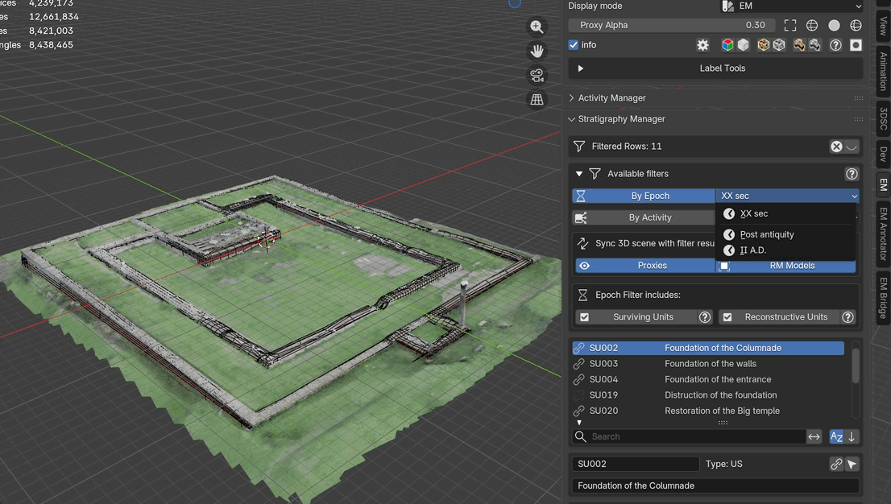

.. _Epochs_Manager:

Epochs Manager
==============

.. _EM_Stratig-Epoch_ManagerFIG:

.. figure:: ../img/EM_Stratig-Epoch_Manager.png
   :width: 400
   :align: center

   Epochs Manager panel

Within this panel epochs are listed following the order indicated in the EM graph.
For every epoch the tool automatically shows the corresponding colors.

.. _FilterEpochGIF:

   Epoch filtering demonstration

Panel Layout
------------

**Epoch List**:

Each row in the list displays:

- The **epoch name** (editable)
- A **color swatch**: click to change the epoch color
- **Select toggle**: selects all proxies belonging to this epoch in the 3D viewport
- **Selectability toggle** (lock icon): locks or unlocks the selection of proxies in this epoch
- **Visibility toggle** (eye icon): shows or hides all proxies belonging to this epoch

**Epoch Details** (collapsible):

When an epoch is selected, time-span data is displayed:

- ``Start`` value (year)
- ``End`` value (year)

To visualize these time values, **user must indicate** the time-span for every row of the EM within the first cell (example: ``II A.D. [start:100;end:199]``).

**Epoch Lighting** (collapsible):

Each epoch can have custom HDR lighting applied to the scene:

- ``Custom Lighting`` toggle: enables per-epoch lighting
- ``HDR Path``: file path to an HDR image for environment lighting
- ``HDR Rotation``: rotation angle in degrees for the world environment
- ``HDR Intensity``: brightness multiplier for the HDR
- ``Apply Epoch Lighting`` button: applies the custom HDR environment to the scene

.. note::
   If custom lighting is enabled but no HDR image path is set, a warning message appears in red.

Workflow
--------

**Filtering by epoch:**

The selections made within the Epochs Manager are used to enable the epoch filter in the :ref:`Stratigraphy_Manager` panel. Select an epoch, then enable the ``By Epoch`` toggle in the Stratigraphy Manager to filter the stratigraphy list.

**Controlling proxy visibility:**

Use the visibility toggle (eye icon) on each epoch row to show or hide all proxies belonging to that epoch. Use the selectability toggle (lock icon) to prevent accidental selection of proxies in specific epochs.

**Applying custom lighting:**

1. Select an epoch in the list
2. Expand the ``Epoch Lighting`` section
3. Enable ``Custom Lighting``
4. Set the path to an HDR image file
5. Adjust rotation and intensity as needed
6. Click ``Apply Epoch Lighting`` to update the scene environment

.. seealso::
   The :ref:`filter_system` section in the Stratigraphy Manager documentation for details on epoch-based filtering and its interaction with other filters.
