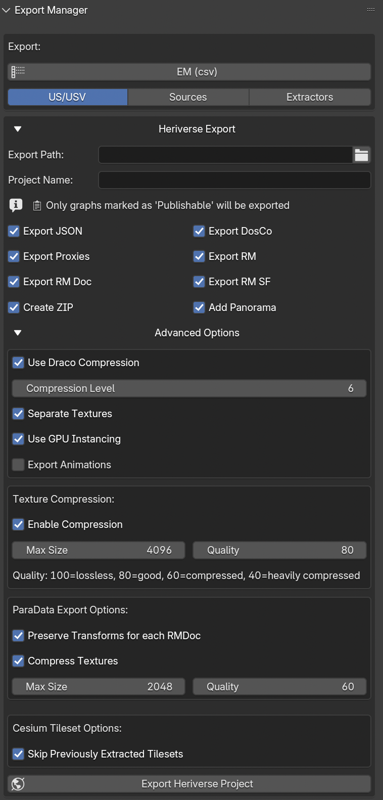

.. _export_manager:

.. _Export_Manager:

Export Manager
==============

.. seealso::

   In the Extended Matrix language manual:

   - :doc:`em-doc:em_data` — the ``em_data.xlsx`` schema and the formal
     data model the Tabular Export pipeline produces.

.. _EM_Export_ManagerFIG:

   Export Manager panel

The **Export Manager** lives in the *EM Bridge* tab of the 3D Viewport
sidebar and groups every exporter EM Tools ships with into a single
panel. Each exporter is rendered as a collapsible sub-section with its
own help-button pointing to its dedicated documentation page.

This page documents the **Tabular Export** and **RDF Export** sections,
and the provenance stamps written beside every exported file. For the
Heriverse publishing pipeline see :doc:`heriverse_export`.

.. _tabular-export:

Tabular Export
--------------

The Tabular Export section dumps the Extended Matrix graph(s) into
plain tabular files for downstream analysis, archival, or ingestion in
external tools (spreadsheets, statistical software, databases).

Two output formats are available:

- **em_data.xlsx** — the 5-sheet canonical workbook containing the
  stratigraphic units (US/USV), Sources, Extractors, and the relational
  tables that link them together. This is the recommended deliverable
  when the goal is to hand over the graph as a self-contained
  spreadsheet.
- **CSV** — a flat dump of individual node groups (US/USV, Sources,
  Extractors). Useful when only one slice of the graph is needed, or
  when integrating with a CSV-only pipeline.

To use the section:

1. Pick the desired table format with the radio toggle
   (``table_type``).
2. Press the ``EM (csv)`` button to export the active graph in the
   chosen format.

The output files are saved next to the current ``.blend`` file unless
a custom path is configured upstream.

.. _rdf-export:

RDF Export
----------

The RDF Export section writes the active graph (or every publishable
graph) as RDF — Turtle, N-Triples, JSON-LD, TriG or RDF/XML — through
the s3Dgraphy exporter.

**Mode** decides what the file is for:

- **Publish** (the default) — the file for a triplestore or for
  anyone outside the study. Translations made by AI and not yet
  verified by a person are **left out**, and so are the nodes removed
  from the graph (tombstones). This is the safe choice when the file
  leaves your hands, and it is why it is the default.
- **Round trip** — the file to read back into EM Tools or s3Dgraphy
  (em.json → TTL → em.json gives the same graph). Everything stays,
  unverified AI translations included, marked as such.

At the end of the export one line in Blender's status bar says what
was written (graphs, nodes, edges, texts tagged with a language, what
was left out), and the full detail is saved beside the file as
``<name>.export-report.txt``. Texts without a language are a
**warning**: declare the study's language in
*EM Setup ▸ Graph info ▸ Language*.

.. _export-stamps:

Provenance stamps of what you export
------------------------------------

When Blender **creates** a file — a glb or glTF, an OBJ with its MTL
and textures, a tileset folder, a ``.3tz`` — EM Tools writes a
``<file>.stamp.json`` beside it (the `dtcstamp
<https://github.com/zalmoxes-laran/dtcstamp>`__ format): the digest of
the bytes (for an OBJ or a separate glTF, of all the files it calls;
for a tileset, of its content), the object of the ``.blend`` it was
made from, the operator and its parameters, the software with its
version, and the date. When the ``.blend`` had unsaved changes the
stamp says so. Exporting again with different bytes keeps the previous
stamp beside the file (``<file>.prev-<digest>.stamp.json``) and makes
the new one a revision of it.

The Heriverse export stamps every distribution it registers; the
exports of 3D Survey Collection are stamped too when EM Tools is
installed. A stamped resource shows a small **seal** beside it in the
DTC and in the Shelf; a click opens it in *Resources & Shelf ▸ Seals*.

To stop writing stamps, turn off **Stamp what you export** in
*Preferences ▸ Add-ons ▸ EM Tools ▸ Provenance*.

.. seealso::

   :doc:`heriverse_export` — for publishing the reconstruction to the
   Heriverse platform (proxies, RM, RB, animations, paradata).
