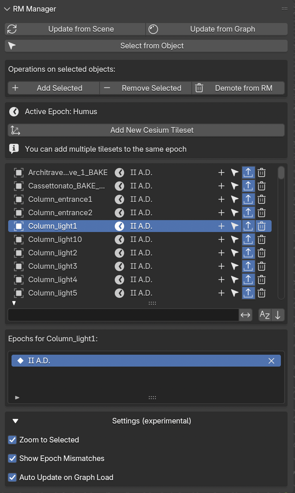

.. _RM_Manager:

Representation Models Manager
=============================

.. seealso::

   In the Extended Matrix language manual:

   - `Paradata NodeGroup <https://docs.extendedmatrix.org/en/1.5/paradata_group.html>`_
     — Representation Models are wrapped as NodeGroups; this is the
     closest formal-language entry point.

.. note::

   The EM 1.5 language manual does not (yet) have a dedicated page for
   Representation Models — the concept lives in the EM Tools side of
   the stack. This cross-link is the closest formalisation; the page
   here is the canonical reference for RM authoring.

.. _RM_ManagerFIG:

   RM Manager panel

.. _add-representation-models:

.. note::

   **Adding representation models to your reconstruction**

   Representation models (RMs) are higher-fidelity 3D versions of
   your stratigraphic proxies, used for visualization and publication.
   They live alongside the proxy graph: the proxy keeps the evidence
   link with full paradata, the RM carries the visual fidelity
   (textures, materials, refined geometry). This panel binds an RM
   to its source proxy, so that the evidence chain travels with the
   rendered output.

.. seealso::

   Importing 2D drawings (sections, plans, orthophotos) and bringing
   them to the correct metric position and scale is a recurring
   companion task — both for RMs and for documents managed via
   :ref:`rmdoc_manager`. See :ref:`place-drawings-as-refs` for the
   full procedure.

This panel (:numref:`Fig. %s <RM_ManagerFIG>`) allows to manage all the Representation models related to the reconstruciton project.
With the three buttons on the upper part of the panel (``Update from Scene``, ``Update from Graph``, and ``Select from Object``) it is possible to upadate the RM list and select the corresponding 3D model.

Other three actions can be made on the selected object by pressing the buttons ``Add Selected``, ``Remove Selected``, and ``Demote from RM``.
The first add the selected RM object to the active epoch, the second remove the active epoch fromm the selected RM object, and the third completely remove the selected RM from both the epochs and the graph.

The ``Add New Cesium Tileset`` allows to simply add an empty Cesium tileset object to the active epoch, this option will be useful for sharing data via the 3D viewer (online or local).

At the center of the panel the RM list shows all the selected Representation Models, on the right side of the list a set of buttons replicste actions already described (**add**, **select**, **publish**, and **remove**).
Under the RM list a box highlights the object currently selected and its the epoch.

When Experimental features are enabled (see :ref:`EMsetup` section), within the ``Settings (experimental)`` section new functions appears; these settings are still under development.

.. _rm_lod:

Levels of Detail (LOD)
----------------------

A Representation Model can ship with multiple **Levels of Detail** (LOD0 = coarsest proxy, up to LOD3 = most detailed). The Manager detects LOD variants automatically from object naming conventions and exposes:

- **Per-item LOD buttons** — click a level (0–3) to swap the mesh of the active RM to that variant. The current LOD is shown depressed.
- **Batch LOD switch** — arrow buttons move *all* RMs up or down one LOD together, useful to toggle the whole scene between preview and final quality.
- **Open Linked File** — jumps to the Blender file where LOD variants are linked from (when using library linking).

LOD switching preserves all transforms, materials and epoch associations; only the mesh data-block is reassigned.

.. _rm_epochs:

RM Epochs
---------

Each RM can belong to one or more epochs. The sublist below the main RM list shows the epochs the selected RM is associated with:

- The epoch marked with the filled keyframe icon is the **first epoch** (the RM first appears in the scene during this epoch).
- Subsequent epochs are shown with a hollow keyframe icon, indicating the RM continues to be visible.
- The ``X`` button removes the epoch association.

Filters in the Stratigraphy Manager and quick visibility controls in the Visual Manager consult this list to decide which RMs to show at a given point in time.

When the scene contains objects whose epoch names don't match any epoch in the active graph (for example after importing an older project), an **Orphaned Epochs** box appears at the top with a mapping table to remap them to valid epochs.
