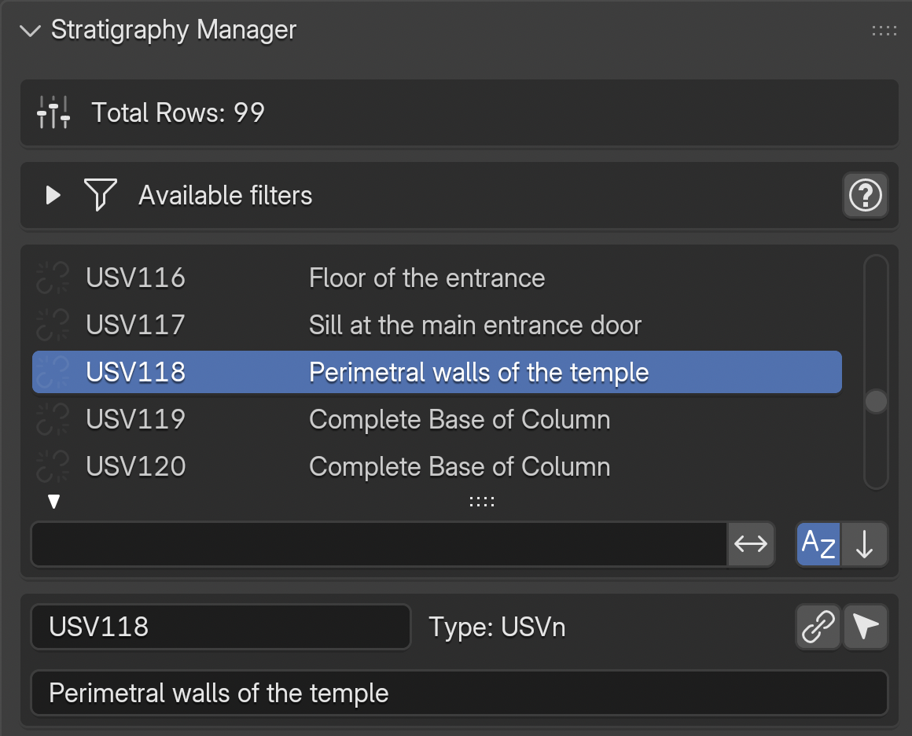
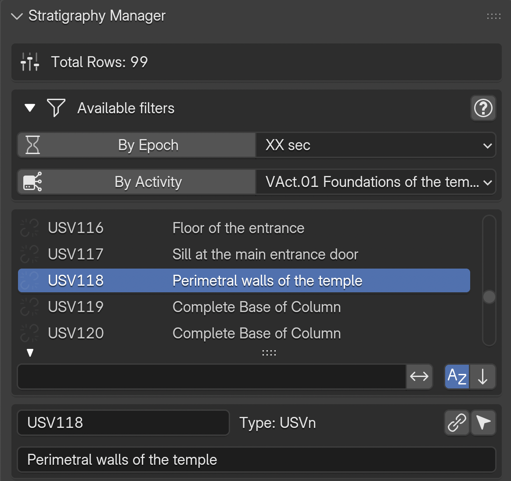
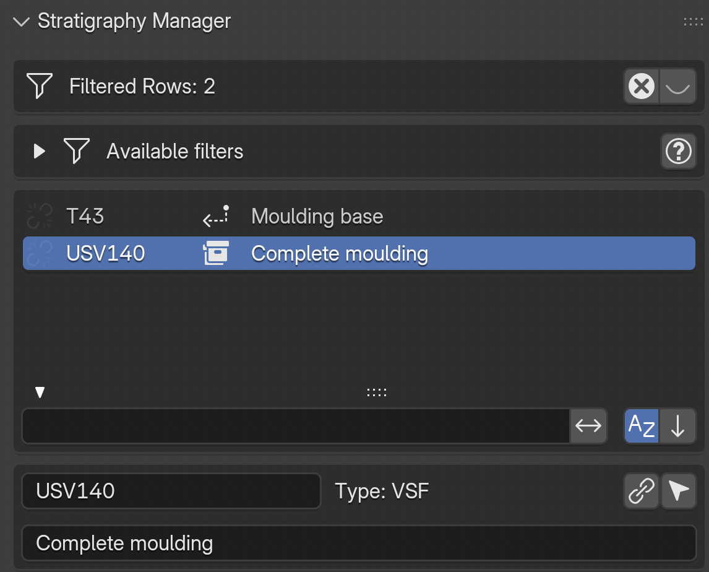
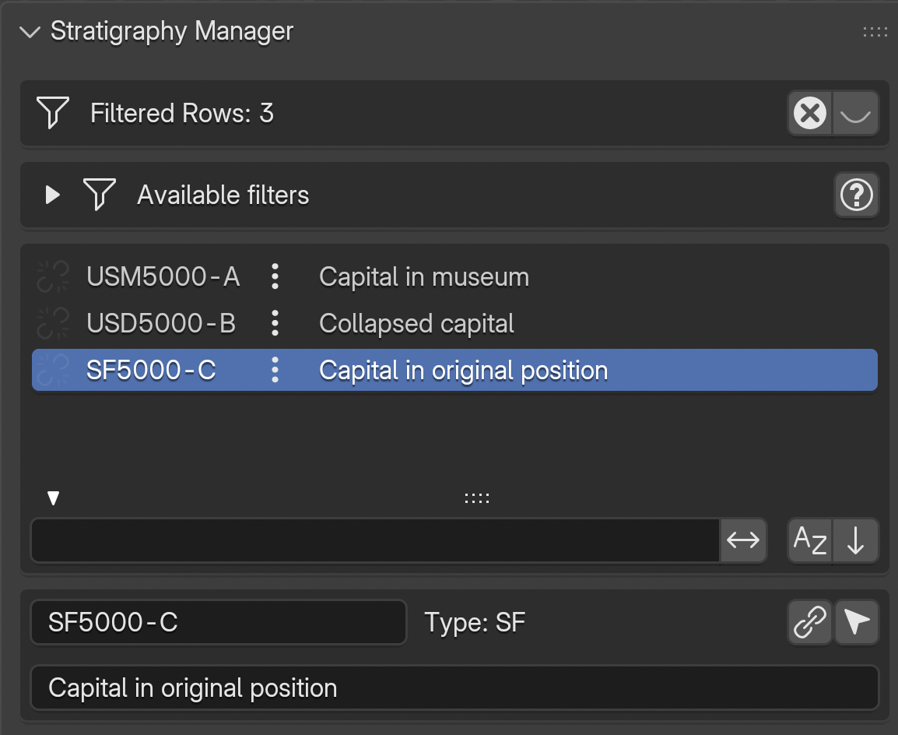

.. _Stratigraphy_Manager:

Stratigraphy Manager
====================

This tool allows to explore and filter all the EM graph nodes. The panel is divided into a header with filter status, an expandable filter section, and a scrollable list of stratigraphic units.

.. _EM_Strat_ManagerFIG:

   Stratigraphy Manager panel overview

Header
------

The header displays the total or filtered row count. When any filter is active, a ``FILTER`` icon appears along with:

- An ``X`` button to reset all filters and restore the full list
- A visibility toggle to show/hide all proxies when resetting

List Rows
---------

Each row in the stratigraphy list displays:

- A **link icon** on the left: indicates whether the node has a corresponding proxy in the 3D scene. A linked chain means the proxy exists; a broken chain indicates a mismatch between the EM graph and the 3D scene (**NB**: a common cause is a mismatch between the node name in the EM and the proxy name in Blender)
- The **node name**
- **Special icons** next to the name (see below)
- The **node description**

Clicking the link icon selects the corresponding 3D proxy. Use Blender's ``Frame Selected`` command to navigate to it.

.. _strat_manager_add_us:

Add Stratigraphic Unit (``+ Add US``)
--------------------------------------

A dedicated toolbar row below the list hosts the **Add US** button (icon: the custom
``proxies_rows_add`` glyph, distinct from Blender's built-in ``+``). The button opens the
shared **Add Stratigraphic Unit** dialog — the same floating form that the Proxy Box
Creator and Surface Areas tools use when the user clicks ``+`` next to their own US
pickers, so US creation is identical everywhere.

The dialog fields (top to bottom):

- **Type** — canonical ``node_type`` from s3Dgraphy's JSON datamodel (v1.5.2 and later).
  Every stratigraphic class the library knows about is listed, including the new
  ``USN`` (Negative Stratigraphic Unit) and the series types (``serSU``, ``serUSD``,
  ``serUSVs``, ``serUSVn``).
- **Name** — bound to the transient sentinel
  ``scene.em_tools.stratigraphy.pending_us_name``. The ``+`` beside the field proposes
  the first free number (gap-aware, starting from 1).
- **Description** — optional; stored on the node.
- **Shared numbering across US types** — default **ON**. When on, the ``+`` button draws
  from a global pool across every US type (any trailing-digits id in the graph counts;
  so ``SU001`` and ``US.1`` share slot ``1``). When off, each type has its own series
  (``USN.1`` independent of ``US.1``).
- **Epoch** *(mandatory)* — drives the Activity filter below; an update on this field
  immediately re-filters the Activity dropdown to units whose own epoch matches.
- **Activity** *(optional)* — when set, the new US gets an ``is_in_activity`` edge and
  the GraphMLPatcher nests the US's XML under the target Activity group at save time.
  A refresh icon inline re-runs the filter if the activity list looks stale.
- **Add stratigraphic link** *(optional)* — toggle to open a sub-block with
  ``is_after`` / ``is_before`` direction + target US picker.
- **Save GraphML immediately** — default **ON**. When on, clicking OK also writes the
  updated graph to disk via ``export.graphml_update`` (write-lock guard handles yEd
  conflicts, mirroring the Proxy Box Creator's "virtuous save" principle).

On OK the shared factory (``us_helpers.create_us_node``) writes the node,
``has_first_epoch`` (mandatory), the optional ``is_in_activity``, and the optional
stratigraphic relation. The new unit is immediately pinned as the active one in the
Stratigraphy Manager list — any panel that reads ``target_us_name`` (Proxy Box,
Surface Areas, Stratigraphy Manager itself) picks it up on the next draw.

.. _filter_system:

Filter System
-------------

Expand the ``Available filters`` section to access all filtering options.

.. _EM_Strat_FiltersFIG:

   Available filter options

**Epoch and Activity Filters**

- ``By Epoch``: toggle to show only units belonging to the selected epoch. Use the dropdown menu to change the active epoch
- ``By Activity``: toggle to show only units belonging to the selected activity group

These two filters can be combined. When epoch filtering is active, additional options appear:

- ``Surviving Units``: include units that survive from earlier epochs into the current one
- ``Reconstructive Units``: include virtual stratigraphic units (USV)

**3D Sync**: When epoch/activity filters are active, a ``Sync 3D scene with filter results`` section appears with options to synchronise the visibility of **Proxies** and **RM Models** in the 3D viewport.

.. _containment_filter:

Containment Filter
------------------

.. _EM_Strat_ContainmentFIG:

   Containment icons: group icon on the container row, back-arrow on contained elements

When a stratigraphic unit acts as a **container** (a US, USD, or VSF containing SF or VSF elements via ``is_part_of`` edges), special icons appear next to the node name:

- **Group icon** on the container row: click to filter the list to show only the container and its contained elements
- **Back-arrow icon** on contained elements: click to navigate back to (select) the parent container row in the current list

The containment relationship is mereological (part--whole): for example, a wall (US) containing a reused capital (SF), or a reconstructed roof (VSF) composed of tile fragments (SF).

.. seealso::
   The `Extended Matrix documentation on containment <https://extendedmatrix.readthedocs.io/en/latest/connectors.html#is-part-of-is-part-of>`_ for the formal specification.

.. _instance_chain_filter:

Instance Chain Filter
---------------------

.. _EM_Strat_ChainFIG:

   Instance chain icon (three dots) on rows connected by dotted connectors

When nodes are connected by **dotted connectors** (``changed_from`` edges), representing the same conceptual object across different epochs, a **three dots** icon appears next to each chain member.

Clicking the three dots icon filters the list to show **all instances in the chain**, sorted chronologically (most recent epoch first).

For example: a capital that exists today on the ground (SF5000-C), existed in a previous epoch as a collapsed element (USD5000-B), and in the Roman era was in its original position (USM5000-A). All three are connected by dotted edges and form a single instance chain.

.. seealso::
   The `Extended Matrix documentation on instance chains <https://extendedmatrix.readthedocs.io/en/latest/connectors.html#instance-chains>`_ for the formal specification and naming conventions.

Filter Interactions
-------------------

Filters are **mutually exclusive by category**:

- Activating the **containment filter** automatically resets epoch, activity, and instance chain filters
- Activating the **instance chain filter** automatically resets epoch, activity, and containment filters
- Activating **epoch or activity filters** resets containment and instance chain filters
- **Selecting a 3D proxy** in the viewport automatically resets containment and instance chain filters to ensure the selected element can be found in the full list

The ``X`` button in the header resets all filters at once.

Selected Item Details
---------------------

When an item is selected in the list, a details box appears below showing:

- The node **name** (editable) and **type**
- A **link** button to associate a 3D proxy with this node
- A **select** button to select the corresponding proxy in the 3D scene
- The node **description**

.. _epoch_filter:

Epoch / Horizon Filter
----------------------

The **Epoch Filter** restricts the stratigraphy list to units belonging to a single epoch.

In **single-graph mode**, the active epoch is chosen from the list in the Epoch Manager; the dropdown above the list shows the current selection. In **landscape mode** (multi-site project), the filter switches to chronological **horizons** defined in the CronoFilter panel, so temporal slicing is consistent across all loaded graphs.

Combined options (shown only when the toggle is active):

- ``Surviving Units`` — include units that were created in an earlier epoch but continue to exist in the current one (``survive_in_epoch`` edges).
- ``Reconstructive Units`` — include virtual stratigraphic units (USV*) belonging to the epoch.

The filter composes with the activity filter: when both are active, only units matching both conditions are shown.

.. _activity_filter:

Activity Filter
---------------

The **Activity Filter** groups stratigraphic units by **activity** — archaeological operations that cluster semantically related US (for example: a demolition, a construction phase, a collapse). Activities are an orthogonal dimension to epochs: the same epoch can contain multiple activities, and one activity can span several epochs.

Activate the toggle, then choose the active activity from the dropdown. When combined with the epoch filter, only units that match both the epoch and the activity are displayed.

Activities are defined in the Activity Manager panel and serialized into the graph via ``is_in_activity`` edges.

.. _survival_filter:

Survival Filter
---------------

The **Survival Filter** is a temporal display rule applied when a single epoch is selected. It controls whether the list shows only units *created* in the selected epoch or **every unit that exists in that epoch** (including those created earlier and still standing).

- **Enabled**: include units whose continuity extends into the selected epoch — in practice "what was standing in epoch X?".
- **Disabled**: show only units created in the selected epoch — "what was built in epoch X?".

The survival of a real stratigraphic unit is governed by the :ref:`continuity_node` rules in the Extended Matrix: real units persist by default until a continuity node terminates them, while virtual units live only where they are declared unless continuity nodes extend them.

.. _reconstruction_filter:

Reconstruction Filter
---------------------

The **Reconstruction Filter** is a conceptual filter that controls whether virtual stratigraphic units (**USV/s**, **USV/n**, **SF**, **VSF** and their group/series variants) are shown alongside physical ones.

- **Enabled**: virtual reconstruction units are included in the list. Use this when editing or reviewing the reconstruction hypothesis.
- **Disabled**: only physically attested units (US, USM, USR, SU, SE, SF …) are shown. Use this when you want to focus on what is directly proved by archaeological evidence.

The filter operates on the *epistemic status* of the units (proved vs. reconstructed), not on their temporal or semantic grouping — it composes with the epoch, activity and survival filters.

Associated Documents
--------------------

An expandable ``Associated Documents`` section shows thumbnails of documents linked to the selected stratigraphic unit. Two view modes are available:

- ``List``: shows documents as rows with thumbnail, name, and action buttons (open file, open folder)
- ``Gallery``: shows documents as a grid of thumbnails using Blender's native icon view

.. note::
   Thumbnails must be generated first from the EM Data Tree panel (see the :ref:`EMsetup` section).
