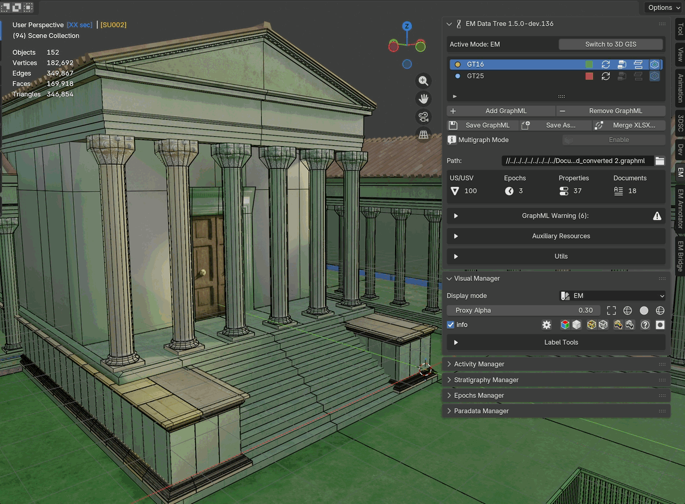

.. _visual_manager:

.. _Visual_Manager:

Visual Manager
==============

.. _EM_VM_panelFIG:

.. figure:: ../img/EM_VM_panel.jpg
   :width: 400
   :align: center

   Visual Manager modes (EM, Epochs, Properties)

This panel (:numref:`Fig. %s <EM_VM_panelFIG>`) consents to manage the appearence of the so-called Proxy models (or Proxies) in the 3D space of Blender.

.. _VisualManagerGIF:

   Visual Manager in action

Within the ``Display mode`` section, users can filter the visualization of the geometries by using ``EM``, ``Epochs``, and ``Properties``.

.. _EM_VM_Proxy_cam_label_01-03FIG:

.. figure:: ../img/EM_VM_Proxy_cam_label_01-03.jpg
   :width: 400
   :align: center

   Visual Manager EM-mode and the labeling workflow

``EM`` will visualize Proxies with a monochromatic material that will match their node (US, USV/s, USV/n, SF, USD, serSU, serUSD, etc..; :numref:`Fig. %s <EM_VM_Proxy_cam_label_01-03FIG>`).

Within the panel (:numref:`Fig. %s <EM_VM_Proxy_cam_label_01-03FIG>`) user can also control the ``alpha`` value of the Proxies' material (0 = completely transparent; 1 = no alpha).
Other display options allow user to visualize ONLY selected Proxies with different modes (``bounding box``, ``wireframe``, ``solid``, ``solid&wireframe``).

The ``Label Tools`` section allows user to automatically create a label related to the selected proxies.

Firstly, to start the labelling process users must create the **CAMS** collection and move inside an already existing **camera** (or a new one), then by pressing the ``Refresh Camera List`` button the tool will automaticcally visualize the camera and display information.

Once the camera has been oriented (**NB**: in order to easily orient the camera on the desired proxy or Proxies, user has different solution: manual orientation, by using default command of Blender, or using the add-on ``Store View``, which is already in Blender) and one or more Proxies has been selected, by pressing the ``Create Labels for Selected`` button a new label will appear.

Since labels will appear within the frame of the camera, **NOT** on top of the Proxies' 3D surface, to visualise them user must enter on the ``Active camera view mode`` of Blender (**Numpad 0** button).

User can also locate labels (as text objects) within the Outliner of Blender in the ``_generated_labels_Camera`` collection.
Once automatically generated, labels can be easily modified by applying the ``Grab``, ``Scale``, and ``Rotate`` commands of Blender. Labels will appear both on the viewport of Blender and on the rendered images.

.. _EM_VM_EpochsFIG:

.. figure:: ../img/EM_VM_Epochs.jpg
   :width: 400
   :align: center

   Visual Manager Epochs-mode

``Epochs`` change Proxies' materials according to the chronological period to which proxy models belong (:numref:`Fig. %s <EM_VM_EpochsFIG>`).

.. _EM_VM_PropertiesFIG:

.. figure:: ../img/EM_VM_Properties.jpg
   :width: 400
   :align: center

   Visual Manager Properties-mode

``Properties`` apply a new material to every Proxy model (:numref:`Fig. %s <EM_VM_PropertiesFIG>`).
This specific section of the panel reads all the properties of the EM.
When a specific property is selected the filter visualizes all the related information.

The panel allows to:

- freely attribute a color material
- select Proxies with the same property
- save the color schema
- load a specific color schema

When ``Display mode`` is set to ``Properties`` a ``Color Ramp`` appears on the lower part of the *Visual Manager* panel.
The menu allows to set the ``Scale Type``, with three option (``Sequential``, ``Diverging``, and ``Qualitative``), and the ``Color Ramp`` type (``Viridis``, ``Blues``, ``Heat``).

Everytime a *Color Ramp* is selected the line ``Selected`` will be automatically updated.
The ``Apply Color Ramp`` button consents to attribute and visualize the color ramp selected in the Property list.
When a color ramp is defined, by pressing the ``Apply Colors to Proxies`` button EMtools will automatically transfer colors to Proxies.

Display Controls
----------------

Below the display mode section, a row of controls is available:

- **Alpha slider**: controls the transparency of the Proxies' material (0 = fully transparent, 1 = fully opaque)
- **Shading buttons**: switch between ``Bounding Box``, ``Wireframe``, ``Solid``, and ``Solid & Wireframe`` display modes for selected proxies
- **Bulk visibility controls**: four show/hide pairs that toggle every object of a given role — see :ref:`Visual_Manager_bulk_visibility` below
- **Material override button**: applies a default material to objects not matched by the EM graph

.. _Visual_Manager_bulk_visibility:

Bulk Visibility Controls
^^^^^^^^^^^^^^^^^^^^^^^^

On the right side of the Display Controls row, four pairs of icon
buttons let you flip the visibility of every object in a given role
in a single click. The pairs, left to right:

- **Proxies** — show / hide every proxy mesh registered in the
  Stratigraphy Manager list.
- **Representation Models (RMs)** — show / hide every RM mesh,
  curve and Cesium-tileset wrapper registered as an RM. Three
  sources are unioned: the RM Manager list, the legacy ``RM``
  Blender collection, and every RM Container (so a mesh that was
  added to a container before an active epoch was set still
  participates).
- **Special Finds (SF)** — show / hide every Special Find mesh in
  the ``SF`` Blender collection.
- **RMDocs** — show / hide every RMDoc quad in the ``RMDoc``
  Blender collection plus its associated camera, kept in
  lock-step so toggling never leaves a dangling camera visible
  without its quad.

Each button operates on **all three of Blender's visibility flags
simultaneously**: the per-view-layer eye icon (the ``H`` key in the
viewport), the "Disable in Viewports" monitor icon, and the
"Disable in Renders" camera icon. This matters when you want to
recover models you previously hid via the eye icon — a single
"Show All" click flips every flag, so anything you hid through
*any* of Blender's three mechanisms comes back. The same symmetry
applies on the Hide side.

.. note::

   *Changed in EM Tools 1.5.4 / 1.6.0-dev.7.* Before this patch
   the RM, SF, and RMDoc show/hide pairs touched only two of the
   three visibility flags, so any object hidden via the ``H`` key
   or the outliner eye icon stayed hidden after a "Show All"
   click. The RM pair also iterated only the RM list and the
   legacy ``RM`` collection — meshes that lived in an RM Container
   without an ``rm_list`` entry were invisible to the operator.
   Both shortcomings are now fixed; the four pairs behave
   consistently.

Color Scheme Save/Load
----------------------

When using the Properties display mode, color schemes can be saved and loaded:

- ``Save Color Scheme`` button: exports the current property-color mapping to a ``.emc`` file
- ``Load Color Scheme`` button: imports a previously saved ``.emc`` file and applies the colors to the property values list

Proxy Inflate Manager (Experimental)
-------------------------------------

.. warning::
   This section is only visible when **Experimental Features** are enabled in the :ref:`EMsetup` panel.

See the :ref:`Proxy_Inflate_Manager` page for full documentation.
