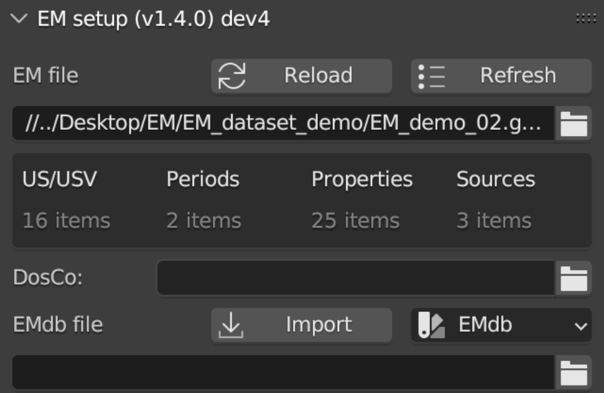
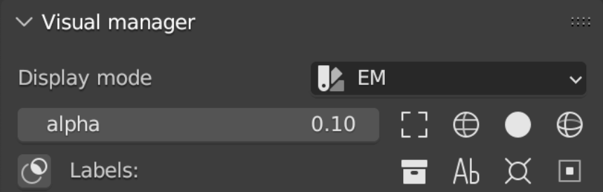
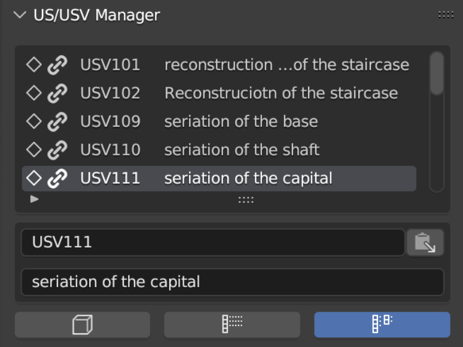

EMtools Structure
=================

The addon is divided in independent panels that can be easily moved within the dedicated space on the sidebar of Blender. 

After the installation panels are organized as follows: 

- EM setup; 

- Visual manager; 
 
- US/USV Manager; 
 
- Paradata Manager; 
 
- Periods Manager; 
 
- EMdb; 

- Export Manager. 

.. _EMsetup:

EM setup
--------------------------

This panel allows to create the first connection between Blender and the Extended Matrix (.graphml file). 
To establish the link EMTools needs to locate the graphml file (NB: before closing the path windows remember to uncheck *relative path* within the settings. 
Alternatively, it is possible to paste the entire path within the empty line). 
After this step, click on the *Reload* button to establish the connection. 
*Refresh* button allows to update the .graphml file, if changes have been applied on the EM graph during the modelling session. 
Once the connection has been established, EMTools will summarize the most important information (US/USV; Periods; Properties; Sources) within a simple table. 

In this panel users can also link the path to the *DosCo* folder. 
For this step users must follow the same suggestions introduced for the EM file path. 

If the EM graph presents a connection with and external database, EMTools allows to import databases to maintain data connection also within Blender. 
To establish the connection, it is necessary to indicate the exact location of the database and then click on the *import* button. 
For this step users must also follow the suggestions that have already been introduced for the EM file path. 

.. _Visual_Manager:

Visual Manager
--------------------------

This panel consents to manage the visual aspect of the information in the 3D space of Blender. 
Within the *display mode* section, users can filter the visualization of the geometries (the so-called Proxy Models or Proxies) by using *EM* or *Periods*. 
On one hand, using *EM* option, user will visualize Proxies with a monochromatic material that will match their specific type of node (US, USV/s, USV/n, SF, etc..). 
On the other, using *Periods* option, Proxies’ materials will be changed in relation to the chronological period to which proxy models will belong. 

Within the panel user can also control the alpha value of the Proxies’ material (0 = no alpha; 1 = completely transparent).
Other display options allow user to visualize ONLY selected Proxies with different modes (bounding box, wireframe, solid, solid&wireframe). 

*Labels* section allows user to automatically create a label related to the selected proxies. 
First, to assign label it is necessary to insert a camera within the 3D scene. 
Second, once the camera has been oriented (NB: in order to easily orient the camera on the desired proxy or Proxies, user has different solution: manual orientation, by using default command of Blender, or using the add-on *Store View*, which is already contained in Blender), user has to define the exact place where labels will be created (in this case both pivot point and 3D cursor can be used as target point). 
Finally, after selecting the desire number of proxies, by clicking the *Ab* button labels will be visualized oriented with point of view of the camera. 
It’s important to understand that labels will be placed within the camera field of view, NOT on the top of the Proxies’ 3D surface. 
*Collection* button permits to create a collection for the labels. 
Once automatically generated, labels can be easily modified by applying the grab, scale and rotate commands of Blender. Labels will appear on the viewport of Blender and on the rendered images. 

.. _US/USV Manager:

US/USV Manager
--------------------------

This panel allows to: control the connection between the EM graph and the 3D environment, visualize a complete list of US/USV; automatically select proxy models within the scene. 

First, user can control the *connection status*. 
A *chain not connected* will be the signal of an issue within the EM graph or within the 3D scene (a frequent issue is due to a mismatch between the node name within the EM and the Proxy name in Blender). 

Second, EMTools allows to visualize a complete list of all the US/USV indicated within the EM. 

Third, user can select proxies by following two solutions: *list to proxy* and *proxy to list*. 
In the first case, after selecting a proxy in the list it will be possible to select that proxy within the 3D scene by clicking on the button with the cube. 
In the second case, after selecting a proxy on the scene it will be possible to highlight that geometry in the list and visualize its name. 
A search option is also available after clicking of the white arrow presents at the bottom of the list. 

It’s important to note that between the search section of the list and the three buttons, two text lines allow to read extensively both the name of the selected proxy and its description. 